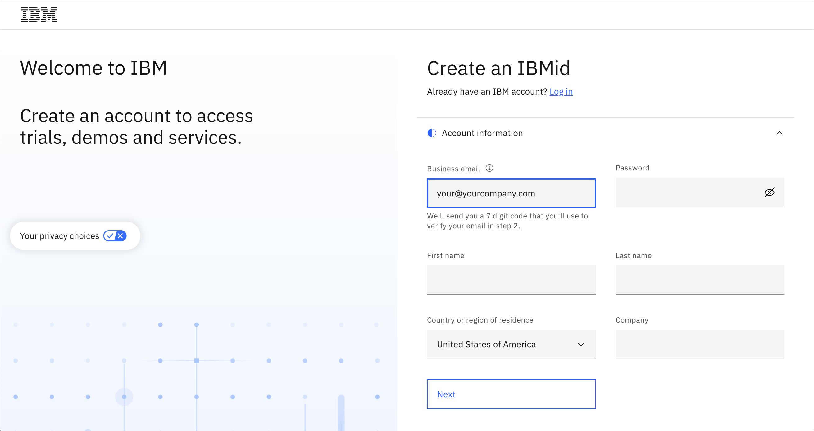
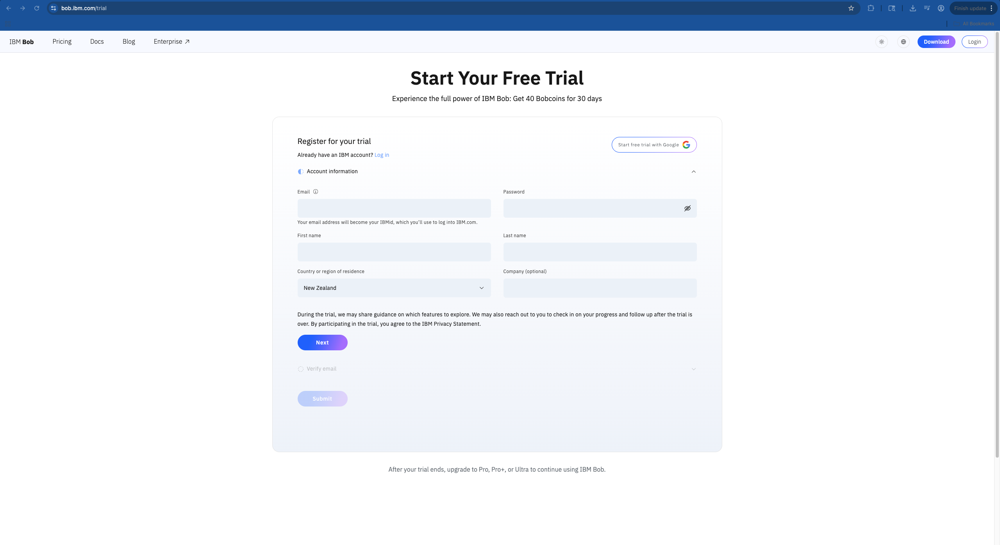
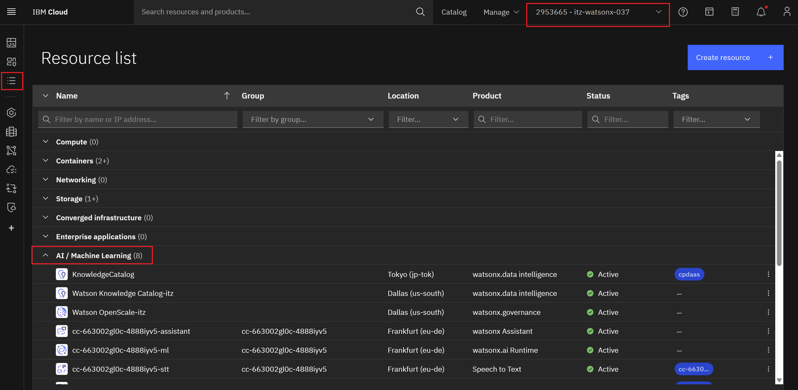
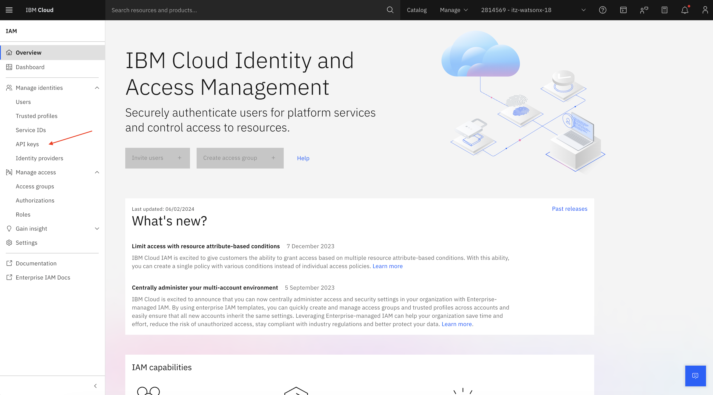
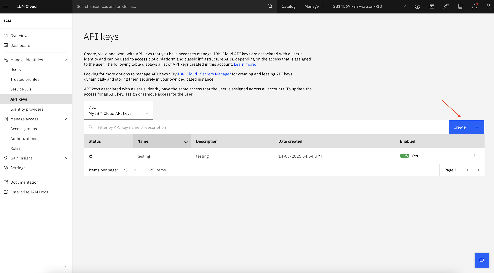
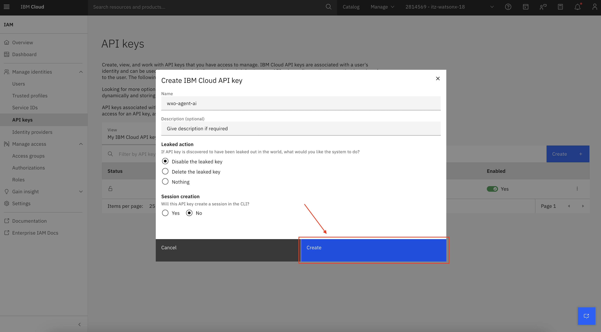
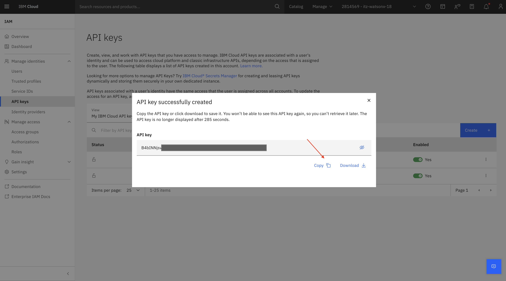

# Chapter 0: Environment Setup

**Time:** Pre-workshop (15-20 minutes)
**Goal:** Set up your IBM Cloud environment and access credentials

---

## 🎯 Overview

Before starting the workshop, you need to set up your IBM Cloud environment. This chapter walks you through:

1. ✅ Creating your IBMid
2. ✅ Registering for Bob trial and installing
3. ✅ Accessing the workshop environment
4. ✅ Locating your resources
5. ✅ Creating an API key for later use
6. ✅ Verifying your setup
7. ✅ Installing the watsonx Orchestrate ADK

**Important:** Complete these steps **at least 48 hours before** the workshop begins to ensure a smooth experience. Account provisioning and approval may take time.

---

## 🛠️ Step 1: Create your IBMid

**⏰ IMPORTANT TIMING:** Complete this step **at least 48 hours before the workshop** to allow time for account provisioning.

**Note:** Follow these brief instructions to create an IBMid. These are specifically for our Business Partners and clients who may not have accessed a TechZone environment previously. IBM employees do not need to register. Clients and Business Partners **must have an IBMid before** you invite them to the workshop environments. They will **not** receive the email inviting them to the workshop account unless they already have an IBMid.

1. Start by accessing the [IBMid Registration Page](https://www.ibm.com/account/reg/signup?formid=urx-19776&).

2. Enter the required information in the fields provided, such as email address, name, company, and country.

3. **IMPORTANT:** Your email address becomes your IBMid, which you will use to access the bootcamp environment.

4. Screenshot reference:

   

5. Click the **Next** button. You will receive an email containing a one-time verification code.

6. In the verification field, enter the code that is provided in the email.

7. Click **Create account**.

8. An email will be sent indicating that your IBMid account creation was successful and your account is now activated.

---

## 🤖 Step 2: Register for Bob Trial and Install

**⏰ IMPORTANT TIMING:** Complete this step **at least 48 hours before the workshop** to allow time for trial approval and access provisioning.

**Note:** Bob is IBM's AI coding assistant that you'll use throughout this workshop. You'll need to register for a trial account and install the application to access Bob's features.

### 2.1 Register for Bob Trial

1. Navigate to the Bob trial registration page: [https://bob.ibm.com/trial](https://bob.ibm.com/trial)

2. **If you already created your IBMid** (from Step 1), you can log in using those credentials.

3. **If you haven't created your IBMid yet**, you can create it directly through the registration form by entering your details:

   

4. Complete the registration process by following the on-screen instructions.

5. Once registered, proceed to install Bob on your system.

### 2.2 Installing IBM Bob

Follow these steps to install IBM Bob. The setup takes about five minutes.

**System Requirements:**

| Component | Requirement |
|-----------|-------------|
| **Operating Systems** | macOS, Linux, or Windows |
| **Memory** | Minimum 4 GB RAM (8 GB recommended) |
| **Storage** | At least 500 MB available disk space |
| **Network** | Active internet connection |

### 2.3 Download IBM Bob

**Get the installer** - Choose the correct version for your operating system:

- **macOS**: Download the `.pkg` file for macOS
- **Linux**: Download the Linux installer
- **Windows**: Download the Windows installer

**Installation Steps:**

1. Download the installer for your operating system from the Bob trial page.

2. **For macOS**: Open the `.pkg` file and complete the steps in the installation wizard.

3. **For Linux/Windows**: Run the installer and follow the on-screen instructions.

### 2.4 Sign in with your IBMid

**Note:** An IBMid is required to authenticate. If you do not have one, see Step 1 above.

1. Open Bob from your applications menu or desktop shortcut.

2. On first launch, Bob will prompt you to sign in.

3. Follow the authentication flow with your browser to login with your IBMid.

4. Return to Bob after authentication is complete.

**Troubleshooting Network Issues:**

If you experience network issues with outbound traffic, you might need to configure your firewall settings. For more information, see the Bob documentation on configuring firewall rules.

**What is Bob?**
- Bob is IBM's AI-powered coding assistant
- Helps with code generation, debugging, and documentation
- Integrates directly into your development workflow
- Provides intelligent suggestions and automation

---

## 🔑 Step 3: Access Class Environment

**Note:** Follow these instructions for accessing your instance of the class environment in order to successfully complete the Agentic AI Bootcamp.

1. When you are invited to the class environment, you'll receive an email from IBM Technology Zone at `noreply@techzone.ibm.com` inviting you to join the account where your class environment is located.

2. In the email, look for the link in the sentence **"Please go HERE to accept your invitation."** as highlighted in the screenshot below.

   

3. **Option:** If you miss the email or do not receive it for any reason, you can find the invitation on your IBM Cloud account:
   [https://cloud.ibm.com/notifications?type=account](https://cloud.ibm.com/notifications?type=account)

4. Please select the **Join Now** link.

   

---

## 📋 Step 4: Manage Environment Resource List on IBM Cloud

1. Please select the environment in the top navigation bar and the resource list icon on the left side.

2. You will find all the required service instances available under the **"AI/Machine Learning"** group.

   

---

## 🔐 Step 5: Creating a Cloud API Key

**Important:** You will need this API key for later chapters, so save it securely!

1. Navigate to [IBM Cloud](https://cloud.ibm.com).

2. Click on **Manage → Access (IAM)**.

   

3. On the next screen, select **API Keys** from the menu.

   

4. Click on **Create**.

   

5. Give your API key a name, then click on **Create**.

   

6. Copy your API key and save it in a secure location. You will need it in later steps.

   

**Security Best Practices:**
- Store your API key in a password manager
- Never commit API keys to version control
- Never share API keys in chat or email
- Treat API keys like passwords

---

## ✅ Step 6: Verify Your Setup

Before installing the ADK, let's verify that all previous steps are complete:

**Checklist:**
- ✅ IBMid created and verified
- ✅ Bob trial registered and application installed
- ✅ Workshop environment invitation accepted
- ✅ Can access IBM Cloud dashboard
- ✅ Can see AI/Machine Learning resources
- ✅ API key created and saved securely

If any items are incomplete, go back and complete them before proceeding to Step 7.

Before installing the ADK, let's verify that all previous steps are complete:

**Checklist:**
- ✅ IBMid created and verified
- ✅ Bob trial registered and application installed
- ✅ Workshop environment invitation accepted
- ✅ Can access IBM Cloud dashboard
- ✅ Can see AI/Machine Learning resources
- ✅ API key created and saved securely

If any items are incomplete, go back and complete them before proceeding to Step 7.

---

## 🛠️ Step 7: Install watsonx Orchestrate ADK

The watsonx Orchestrate Agent Development Kit (ADK) allows you to create, test, and deploy agents and tools from your command line.

**Prerequisites:**
- Python 3.8 or higher installed
- pip (Python package installer) installed

**To check if you have Python and pip installed:**
```bash
python --version
pip --version
```

If you don't have Python or pip installed, download Python from [python.org](https://www.python.org/downloads/) (pip is included with Python 3.4+).

### 7.1 Using a Virtual Environment (Recommended)

For better package management and isolation, we recommend using a virtual environment:

**Create your virtual environment:**

```bash
python -m venv .venv
```

**Note:** If the above command doesn't work, try using `python3` instead:
```bash
python3 -m venv .venv
```

**Activate your virtual environment:**

**macOS & Linux:**
```bash
source ./.venv/bin/activate
```

**Windows:**
```cmd
.venv\Scripts\activate
```

**Install the ADK:**

```bash
pip install ibm-watsonx-orchestrate
```

### 7.2 Verify Installation

Check that the ADK is installed correctly:

```bash
orchestrate --version
```

You should see the version number displayed.

**Additional Installation Options:**

For more advanced installation methods including using `uv` or other version managers, see the [official ADK installation guide](https://developer.watson-orchestrate.ibm.com/getting_started/installing#system-installation).

**Note:** You'll configure your ADK environment in Chapter 2 when you're ready to use it.

---

## ✅ Verification Checklist

Before proceeding to Chapter 1, verify you have completed:

- ✅ Created your IBMid
- ✅ Registered for Bob trial account and installed Bob
- ✅ Accepted the workshop environment invitation
- ✅ Can access IBM Cloud dashboard
- ✅ Can see AI/Machine Learning resources in your resource list
- ✅ Created and saved your API key securely
- ✅ Installed watsonx Orchestrate ADK

---

## 📝 Troubleshooting

### Issue: Didn't receive invitation email

**Solution:**
- Check spam/junk folder
- Verify you used the correct email for IBMid registration
- Check IBM Cloud notifications: [https://cloud.ibm.com/notifications?type=account](https://cloud.ibm.com/notifications?type=account)
- Contact workshop organiser

### Issue: Can't see resources in IBM Cloud

**Solution:**
- Verify you accepted the invitation
- Check you're in the correct account (top navigation bar)
- Refresh the page
- Contact workshop organiser

### Issue: API key creation fails

**Solution:**
- Verify you have proper permissions
- Try a different browser
- Clear browser cache
- Contact workshop organiser

---

## 🎯 Ready for the Workshop!

Once you've completed all steps and verified your setup, you're ready to begin the workshop.

**Next Step:** Proceed to [Chapter 1: Your First AI Assistant](./Chapter_1_Your_First_AI_Assistant.md)

---

## 📚 Additional Resources

- [IBM Cloud Documentation](https://cloud.ibm.com/docs)
- [IBMid Help](https://www.ibm.com/account/help)
- [watsonx Orchestrate Documentation](https://www.ibm.com/docs/en/watsonx/watson-orchestrate)

---

**Chapter Author:** Libby Lavrova  
**Last Updated:** May 7, 2026  
**Version:** 1.0  
**Estimated Time:** 15-20 minutes  
**Difficulty:** ⭐ Beginner

---

[← Back to Main Guide](../README.md) | [Next: Chapter 1 →](./Chapter_1_Your_First_AI_Assistant.md)