# Chapter 1: Your First AI Assistant

**Time:** 11:45 AM - 12:15 PM (30 minutes)
**Goal:** Get comfortable with watsonx Orchestrate through a simple, immediate use case

---

## 🎯 Learning Objectives

By the end of this chapter, you will:

1. ✅ Create your first AI agent in watsonx Orchestrate
2. ✅ Upload and process a PDF document
3. ✅ Ask natural language questions about the document
4. ✅ Understand the limitations of manual document processing
5. ✅ See why automation is necessary for scale

---

## 📖 What We're Building

A simple AI assistant that can answer questions about a maritime threat report using document upload.

**Use Case:** You have an ONI (Office of Naval Intelligence) Worldwide Threat to Shipping Report. Instead of reading through the entire PDF manually, you'll create an AI assistant that can instantly answer questions about threats, incidents, and regions.

---

## 🚀 Step-by-Step Instructions

### Step 1: Access watsonx Orchestrate and Create Your Agent (5 minutes)

**Prerequisites:** Complete [Chapter 0: Environment Setup](./Chapter_0_Environment_Setup.md) before proceeding.

Step-by-step instructions:

1. Navigate to [IBM Cloud Resources](https://cloud.ibm.com/resources).

2. Expand the **AI / Machine Learning** section.

3. Select your **watsonx Orchestrate** instance.

   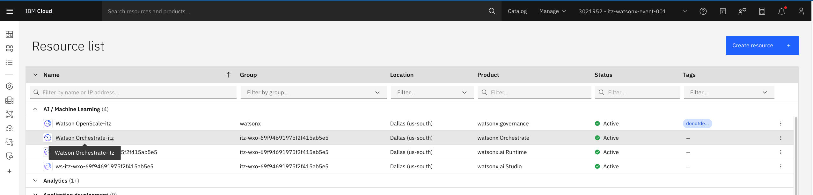

4. Click **"Launch watsonx Orchestrate"**.

   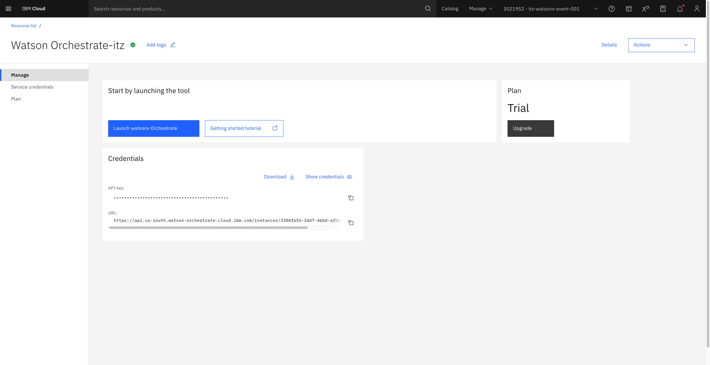

5. This will open the watsonx Orchestrate homepage in your browser.

6. Click on **"Create new agent"**, as shown below:

   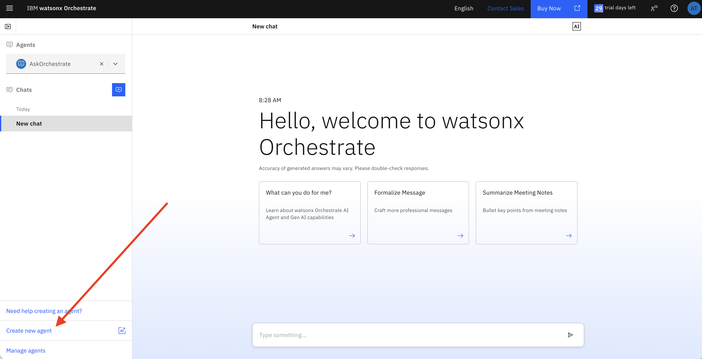

7. Select the **"Create from scratch"** tab.

   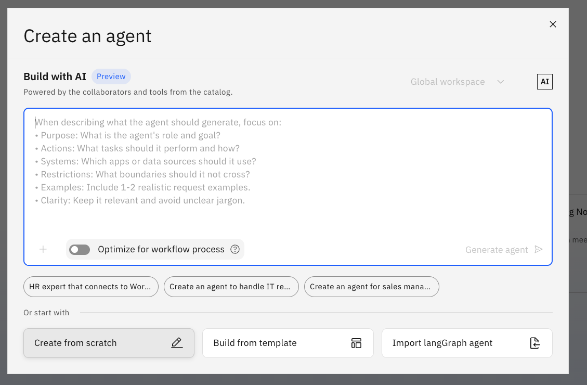

8. Give your agent a name. Enter:

   ```
   Maritime Intelligence Assistant
   ```

9. For the description, enter the following:

   ```
   Answers questions about uploaded maritime threat reports from ONI
   ```

10. Click the **"Create"** button to create your agent.

    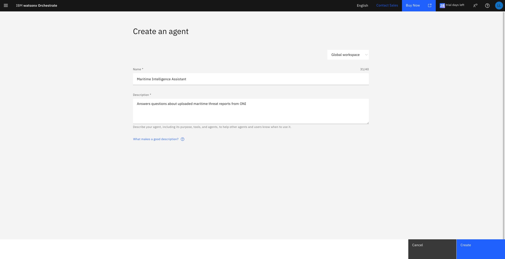

**🎉 Congratulations!** You've just created your first AI agent! Your Maritime Intelligence Assistant is now ready to be configured.

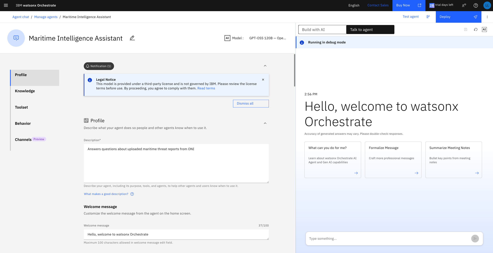

---

### Step 3: Download the ONI Report (3 minutes)

**Option A: Download from ONI Website**

1. **Open a new browser tab**

2. **Navigate to:**
   ```
   https://www.oni.navy.mil/ONI-Reports/Shipping-Threat-Reports/Worldwide-Threat-to-Shipping-Report-Archive/
   ```

3. **Find the latest report and click "Go"** to get the latest report (or use FileId/207048/ for the sample)

4. **Download the PDF** to your computer
   - Save it somewhere easy to find (e.g., Desktop or Downloads)
   - Note the filename (e.g., `WTS_Report_April_2026.pdf`)

**Option B: Use Provided Sample Report**

A sample ONI Worldwide Threat to Shipping report is included in this repository for practice:

- **File location:** [`assets/chapter-1/ONI_WTS_Sample_Report.pdf`](./assets/chapter-1/ONI_WTS_Sample_Report.pdf)
- **Date:** August 4, 2026
- Download this file to your computer to use in the next step

---

### Step 4: Upload Document to Agent (5 minutes)

1. **Open your agent** (Maritime Intelligence Assistant)

2. **Go to the Knowledge section** by selecting "Knowledge" on the left panel or by scrolling down to the section.

   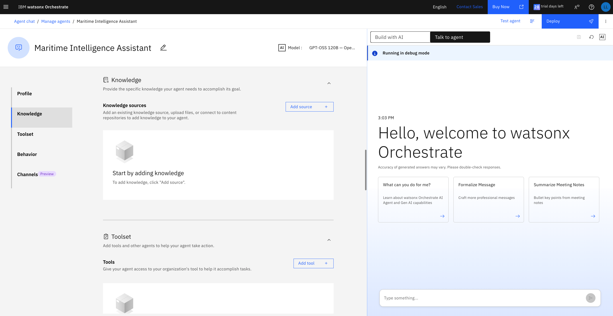

3. **Click "Add source"**, then select **"New knowledge"**.

   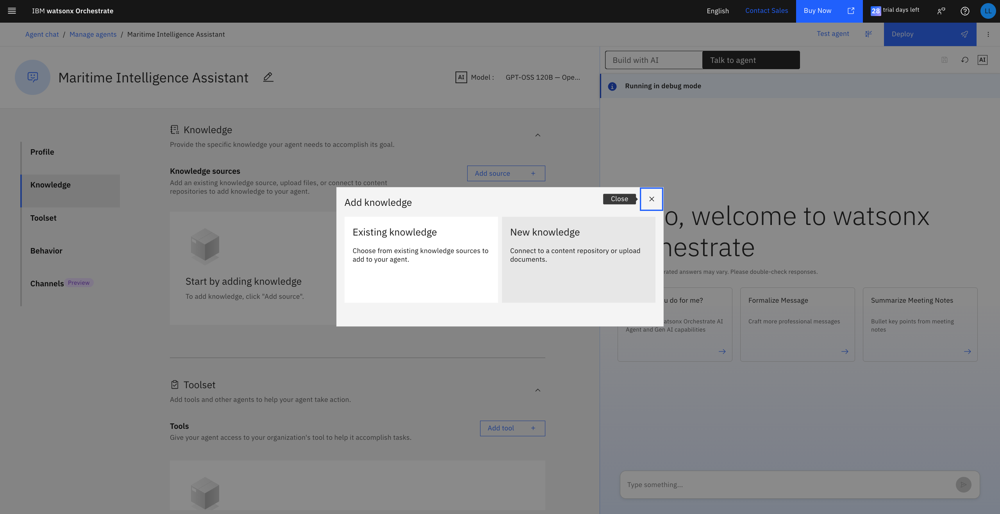

4. **Scroll down and select "Upload files"**, then click the **Next** button.

   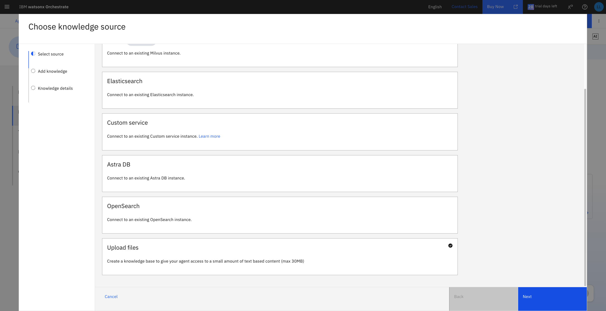

5. **Drag and drop your ONI report PDF onto the page, or click to upload and locate your file.**

   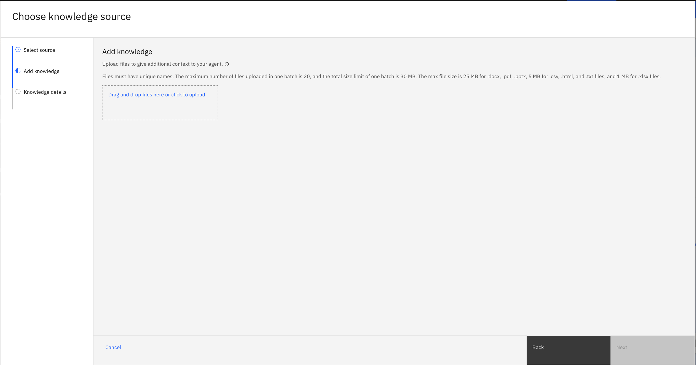

6. **Click the Next button** to proceed.

   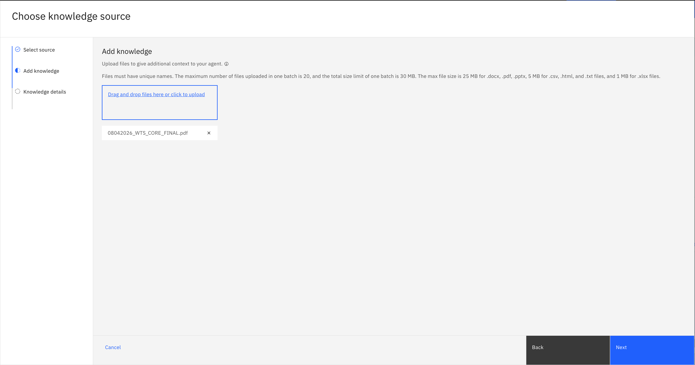

7. **Add a Name and Description for your knowledge source:**

   **Name:**
   ```
   ONI Worldwide Threat to Shipping Report
   ```

   **Description:**
   ```
   Contains maritime security incidents, piracy reports, and shipping threats worldwide. Use this knowledge to answer questions about maritime incidents, vessel attacks, regional threat levels, and security recommendations for shipping operations.
   ```

   > **Note:** The agent will use this description to decide whether to invoke this knowledge when performing a task, so make it clear and specific.

8. **Click the Save button** to save your knowledge source.

   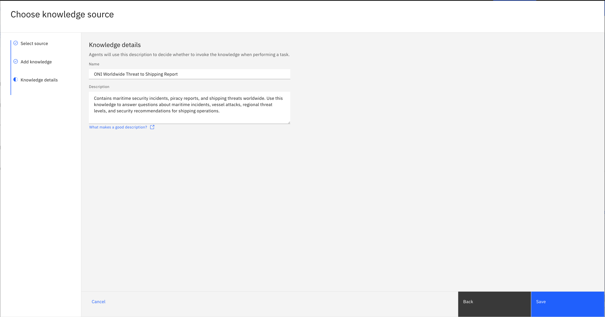

9. **Wait for processing:**
   - You'll see a progress indicator
   - Processing typically takes 30-60 seconds
   - Wait for **"Knowledge ready"** to appear in the top right corner

---

### Step 5: Test Your Assistant (10 minutes)

Now the fun part - let's ask questions!

1. **Click into the "type something..." section** in the bottom right of the screen to open the chat interface.

   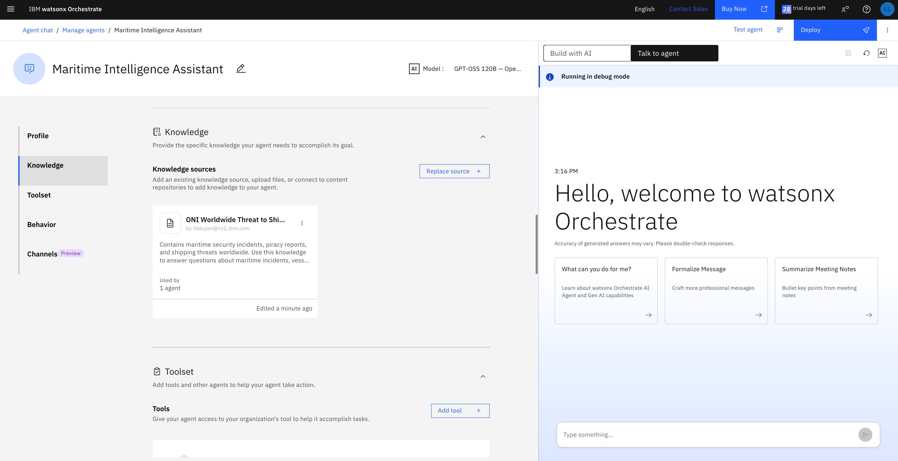

2. **Test Query 1: General Overview**

   **Type this question:**
   ```
   What are the main threats reported in this document?
   ```

   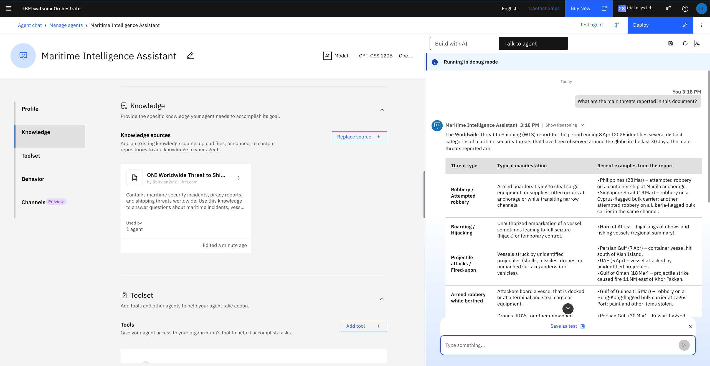

   **What to observe:**
   - ✅ Agent reads the document
   - ✅ Extracts key threat types (piracy, robbery, etc.)
   - ✅ Provides a comprehensive summary
   - ✅ Response time: 3-5 seconds

   **Example response** (your output may vary as LLMs are non-deterministic):

   The agent should identify the main threat categories from the WTS report, such as:

   - **Robbery / Attempted robbery** - Armed boarders targeting cargo, equipment, or supplies (e.g., Philippines, Singapore Strait)
   - **Boarding / Hijacking** - Unauthorised vessel embarkation, sometimes leading to seizure (e.g., Horn of Africa)
   - **Projectile attacks / Fired-upon** - Vessels struck by missiles, drones, or unmanned vehicles (e.g., Persian Gulf, UAE, Gulf of Oman)
   - **Armed robbery while berthed** - Attacks on docked vessels (e.g., Gulf of Guinea)
   - **Unmanned vehicle attacks** - Drone or ROV strikes (e.g., Persian Gulf)
   - **Suspicious approaches** - Unidentified vessels coming close without clear intent
   - **Blocking / Protest actions** - Vessels deliberately impeded

   The response should also note:
   - Robbery and attempted robbery are most frequent in high-traffic areas (Singapore Strait, Manila)
   - Projectile and unmanned-vehicle attacks concentrated in Persian Gulf region
   - Ongoing risks in Red Sea, Black Sea, Gulf of Aden, and Gulf of Guinea

   > **Note:** Because the agent uses a Large Language Model (LLM), responses are non-deterministic - your exact output may differ in wording and structure while covering similar content.

   **Understanding how the agent works:**

   After receiving the response, **click "Show reasoning"** to see how the agent used your knowledge source to answer the question.

   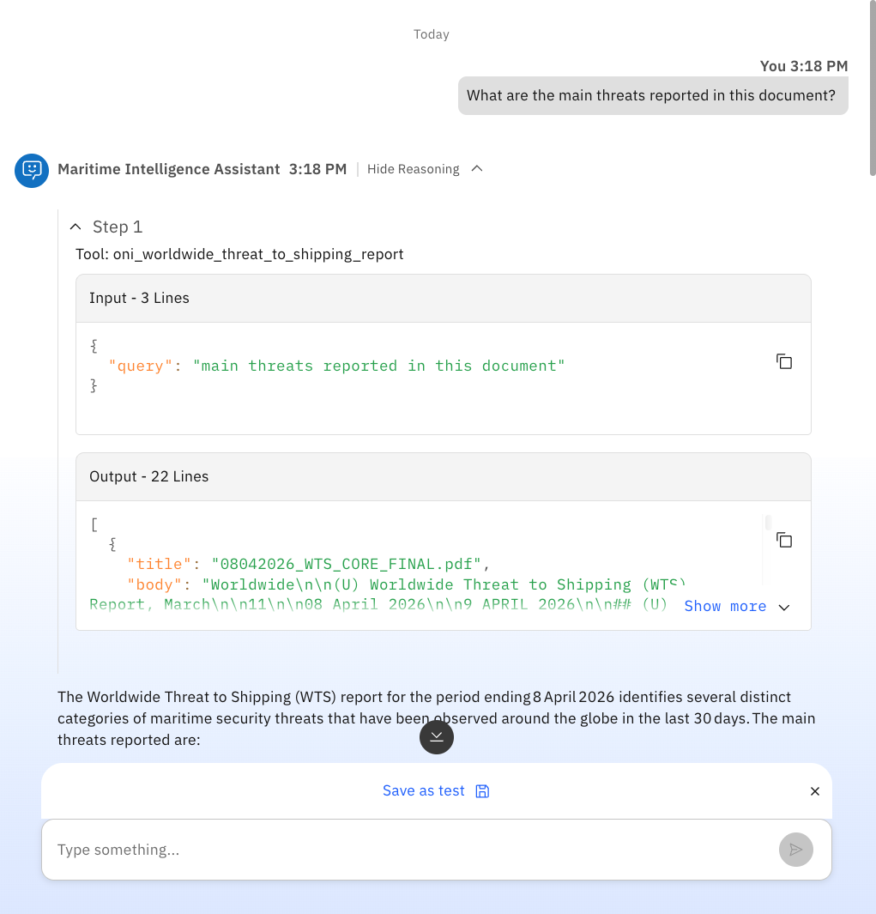

   This reveals:
   - Which knowledge source(s) the agent consulted
   - What information it extracted from the document
   - How it synthesised the answer from the source material

   > **Key insight:** This transparency helps you understand and trust the agent's responses, and verify that it's using the correct knowledge sources.

3. **Test Query 2: Regional Focus**

   **Type this question:**
   ```
   Are there any incidents near Somalia?
   ```

   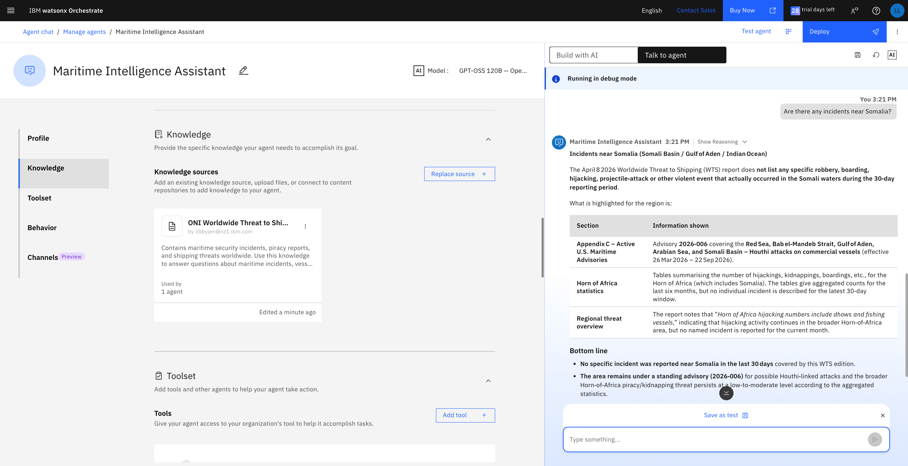

   **What to observe:**
   - ✅ Agent searches for Somalia-related incidents
   - ✅ Analyses the regional context
   - ✅ Provides advisory information

   **Example response** (your output may vary as LLMs are non-deterministic):

   The agent should report that:

   **No specific incidents in the 30-day period:**
   - No robbery, boarding, hijacking, or projectile attacks were reported in Somali waters during the reporting period

   **Active advisories and context:**
   - **Advisory 2026-006** covers Red Sea, Bab el-Mandeb Strait, Gulf of Aden, Arabian Sea, and Somali Basin
   - Advisory warns of Houthi attacks on commercial vessels (effective 26 Mar 2026 - 22 Sep 2026)
   - Horn of Africa statistics show aggregated counts for hijackings, kidnappings, and boardings over six months
   - Regional threat overview notes that "Horn of Africa hijacking numbers include dhows and fishing vessels"

   **Recommendations:**
   - Vessels should follow Advisory 2026-006
   - Maintain heightened watch-standing
   - Consider Best Management Practices (BMPs) for piracy-prone areas
   - Stay in contact with maritime security agencies (UKMTO, US CICP, regional naval patrols)

   > **Note:** Because the agent uses a Large Language Model (LLM), responses are non-deterministic - your exact output may differ in wording and structure while covering similar content.

4. **Test Query 3: Vessel Information**

   **Type this question:**
   ```
   What types of vessels were targeted?
   ```

   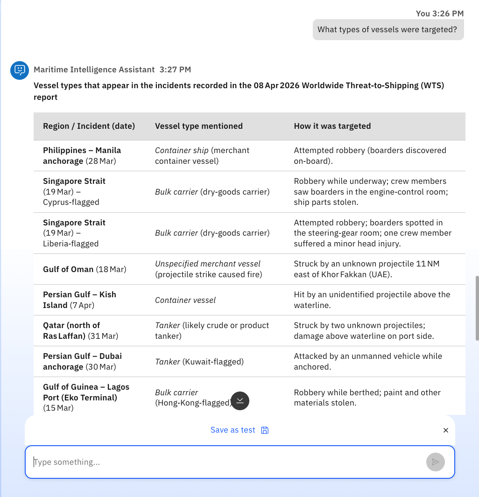

   **What to observe:**
   - ✅ Agent identifies vessel types (cargo, tanker, etc.)
   - ✅ May provide statistics
   - ✅ Contextual information

5. **Test Query 4: Incident Summary**

   **Type this question:**
   ```
   Summarise the piracy incidents
   ```

   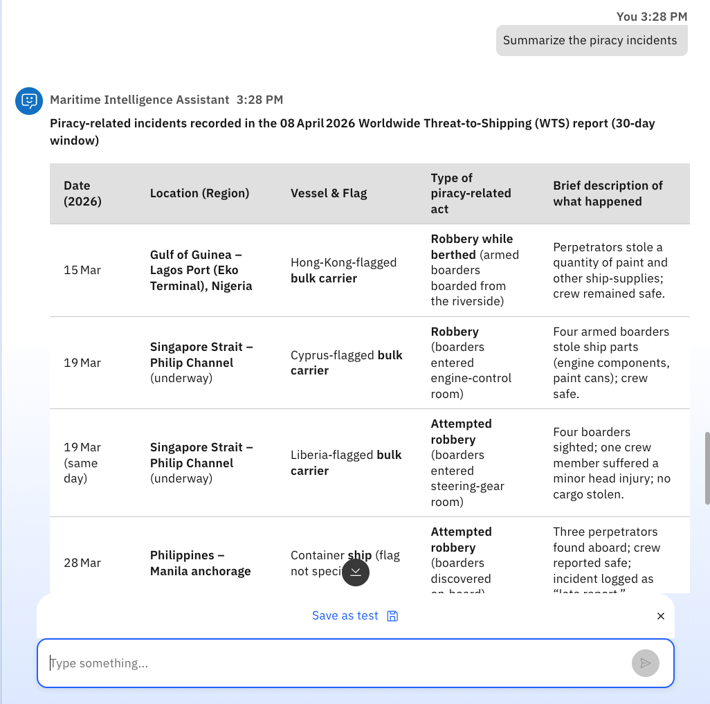

   **What to observe:**
   - ✅ Agent filters for piracy-specific incidents
   - ✅ Provides concise summary
   - ✅ Key details included

6. **Test Query 5: Threat Assessment**

   **Type this question:**
   ```
   What regions have the highest threat levels?
   ```

   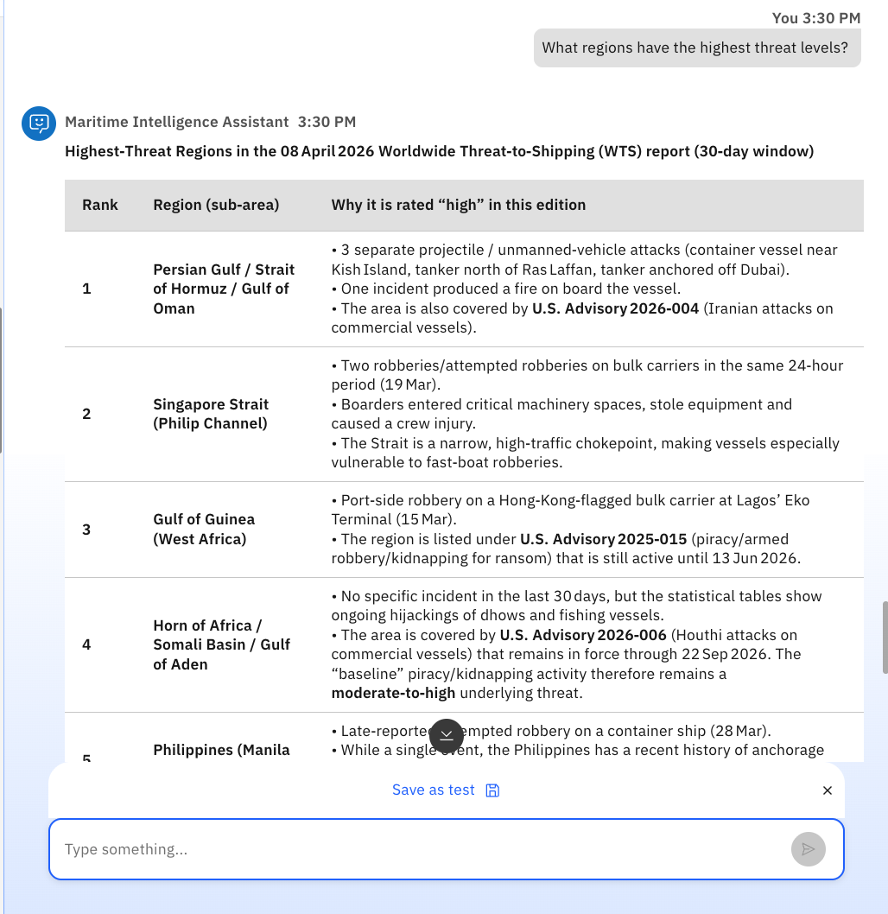

   **What to observe:**
   - ✅ Agent analyses incident distribution
   - ✅ Identifies high-risk regions
   - ✅ Provides reasoning

---

### Step 6: Understand the Limitations (5 minutes)

**Group Discussion:** Now that you've seen it work, let's talk about limitations.

#### What Works Well ✅

- Quick answers to specific questions
- Good for exploring a single document
- Natural language interface
- No coding required
- Immediate results

#### What Doesn't Scale ❌

**The Challenge:**
```
Imagine you're a maritime intelligence analyst...

Current Reality:
- 50+ reports arrive daily
- Multiple sources (ONI, IMB, UKMTO, news)
- Manual upload for each document
- Repetitive questions across documents
- No automated synthesis
- No real-time updates
- No automated alerting
```

**Questions to Consider:**

1. **Manual Upload Problem:**
   - How long would it take to upload 50 reports daily?
   - What if reports arrive at different times?
   - How do you ensure nothing is missed?

2. **No Cross-Document Analysis:**
   - How do you find patterns across multiple reports?
   - How do you compare this week vs. last week?
   - How do you track trends over time?

3. **No Automation:**
   - What if a critical threat appears at 2 AM?
   - How do you get alerted automatically?
   - How do you generate daily briefings?

4. **No Integration:**
   - How do you combine with weather data?
   - How do you add real-time news?
   - How do you connect to other systems?

---

## 🎓 Key Takeaways

### What You Learned

1. ✅ **AI can understand documents** - No need to read 50-page PDFs manually
2. ✅ **Natural language works** - Ask questions like you would ask a colleague
3. ✅ **Quick setup** - From zero to working assistant in 15 minutes
4. ✅ **Immediate value** - Useful for one-off document analysis

### The Big Limitation

> **"This is great for one document, but what about 50 reports daily?"**

This is where **automation** and **integration** come in - which we'll build in the next chapters!

---

## 🔄 What's Next?

In **Chapter 2**, you'll learn how to:

- **Automate data retrieval** - No more manual uploads
- **Integrate multiple sources** - Weather, news, reports
- **Use IBM Bob** - AI generates the code for you
- **Build real tools** - That scale to production

**The Transformation:**
```
Chapter 1: Manual document upload → Ask questions
                    ↓
Chapter 2: Automated retrieval → Multi-source intelligence → Automated reports
```

---

## 📝 Troubleshooting

### Issue: Can't find "Create Agent" button

**Solution:**
- Check you're in the "Agents" section
- Look for "Build" or "Development" menu
- Try refreshing the page
- Ask instructor for help

### Issue: Document upload fails

**Solution:**
- Check file size (should be < 50MB)
- Verify it's a PDF file
- Try a different browser
- Check internet connection

### Issue: Agent gives poor answers

**Solution:**
- Verify document is fully processed (check status)
- Try more specific questions
- Rephrase your question
- Check if document uploaded correctly

### Issue: Slow responses (> 10 seconds)

**Solution:**
- Check internet connection
- Try again (may be temporary)
- Report to instructor if persistent

---

## 💡 Tips for Success

1. **Be Specific:** "What piracy incidents occurred in April?" is better than "Tell me about piracy"

2. **Ask Follow-ups:** Build on previous answers to go deeper

3. **Experiment:** Try different question styles to see what works best

4. **Take Notes:** Document what works well for your use cases

---

## 📊 Success Criteria

You've successfully completed Chapter 1 if:

- ✅ Created an agent in watsonx Orchestrate
- ✅ Uploaded a PDF document
- ✅ Asked at least 5 questions successfully
- ✅ Received relevant, accurate answers
- ✅ Understand why this doesn't scale to 50 reports/day

---

## 🎯 Chapter 1 Complete!

**Time Check:** You should have completed this in ~25 minutes

**What You Built:**
- ✅ Your first AI assistant
- ✅ Document Q&A capability
- ✅ Foundation for more complex systems

**Ready for Chapter 2?**
After lunch, we'll use IBM Bob to build automated intelligence tools that scale!

---

## 📚 Additional Resources

### For Further Learning

- [watsonx Orchestrate Documentation](https://www.ibm.com/docs/en/watsonx/watson-orchestrate)
- [ONI Threat Reports Archive](https://www.oni.navy.mil/ONI-Reports/)
- [Best Practices for Document Q&A](./reference/Document_QA_Best_Practices.md)

### Sample Questions to Try

```
1. How many incidents were reported in total?
2. What is the most common type of incident?
3. Which vessels were hijacked?
4. Are there any incidents involving crew injuries?
5. What security recommendations are provided?
6. Compare incidents in the Gulf of Aden vs. Malacca Strait
7. What time of day do most incidents occur?
8. Are there any patterns in the incident locations?
```

---

**Chapter Author:** Libby Lavrova  
**Last Updated:** May 5, 2026  
**Version:** 1.0  
**Estimated Time:** 30 minutes  
**Difficulty:** ⭐ Beginner

---

[← Chapter 0: Environment Setup](./Chapter_0_Environment_Setup.md) | [Back to Main Guide](../README.md) | [Next: Chapter 2 →](./Chapter_2_Document_Analysis_Agent.md)