# Chapter 2 Part A: Weather Tool with IBM Bob

**Time:** 1:00 PM - 1:25 PM (25 minutes)  
**Goal:** Use IBM Bob to generate a complete weather intelligence tool  
**Difficulty:** Intermediate  
**Prerequisites:** Completed Chapter 1, IBM Bob access

---

## 🎯 Learning Objectives

By the end of this section, you will:

1. ✅ Understand how to prompt IBM Bob for code generation
2. ✅ Generate a complete Python tool using AI
3. ✅ Create YAML configuration files with Bob
4. ✅ Import and test tools in watsonx Orchestrate
5. ✅ Experience AI-accelerated development workflow

---

## 💡 The New Paradigm: AI-Assisted Development

### Traditional Development (Hours)
```
1. Research weather APIs
2. Write Python code manually
3. Handle errors and edge cases
4. Create configuration files
5. Write documentation
6. Test everything
```

### AI-Assisted Development (Minutes)
```
1. Describe what you need to Bob
2. Bob generates complete code
3. Review and test
4. Deploy to Orchestrate
```

**Time Savings: 10x faster development!**

---

## 📖 What We're Building

A weather intelligence tool that:
- Uses Open-Meteo API (no API key required!)
- Takes location coordinates as input
- Returns current weather and 7-day forecast
- Includes maritime-specific data (wind speed, humidity, temperature)
- Returns structured JSON output
- Handles errors gracefully

**Why Open-Meteo?**
- ✅ No API key needed - zero setup!
- ✅ Unlimited free calls
- ✅ Fast response times (< 2 seconds)
- ✅ 16-day forecast available
- ✅ Reliable and well-maintained

---

## 🚀 Step-by-Step Instructions

### Step 1: Access IBM Bob (2 minutes)

#### 1.1 Follow the environment setup instructions
   - If you haven't already, complete [Chapter 0: Environment Setup](./Chapter_0_Environment_Setup.md) Step 2 to register for Bob trial and install the application
   - Ensure Bob is installed and you're signed in with your IBMid

#### 1.2 Open IBM Bob
   - Launch Bob from your applications menu or desktop shortcut
   - You should see the Bob interface ready to assist

   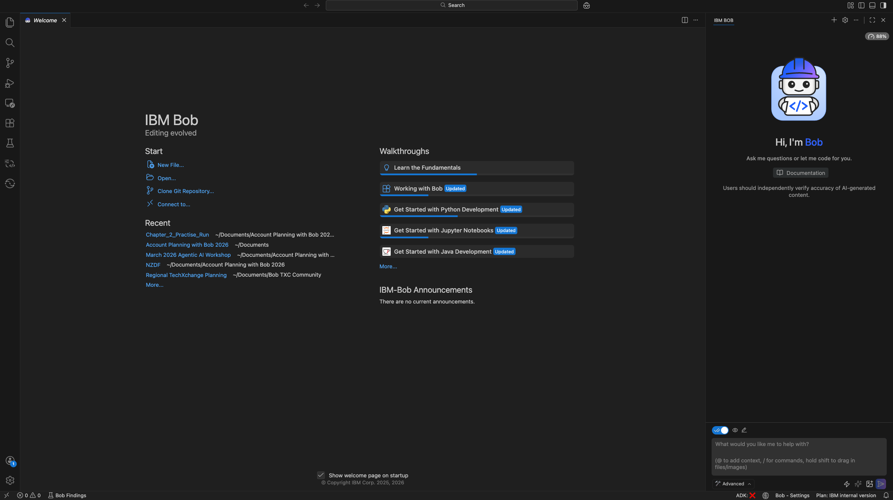

#### 1.3 Verify Bob is ready
   - Test with: "Hello Bob, are you ready to help me code?"
   - Bob should respond confirming it's ready to assist

   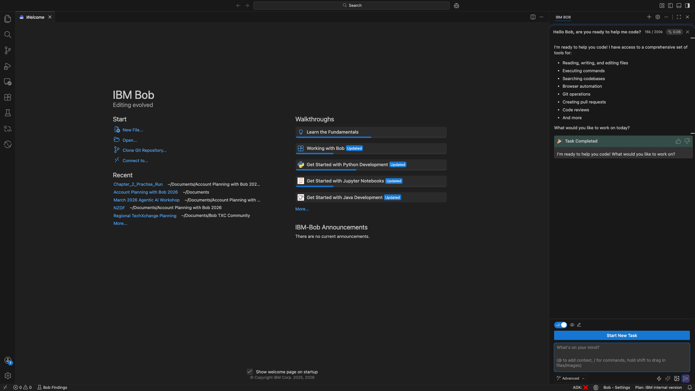

**Bob's Key Capabilities:**
- Code generation in multiple languages
- Configuration file creation
- Documentation generation
- Test script creation

#### 1.4 Create Your Workshop Folder

Before we start generating code, let's create a dedicated folder for all workshop files.

**Steps:**

1. In Bob, click **"Open..."** under the Start section

2. Navigate to your **Documents** folder

3. Create a new folder called **`NZDF_Agentic_AI_Workshop`**
   - Right-click in the Documents folder
   - Select "New Folder" (or equivalent for your OS)
   
   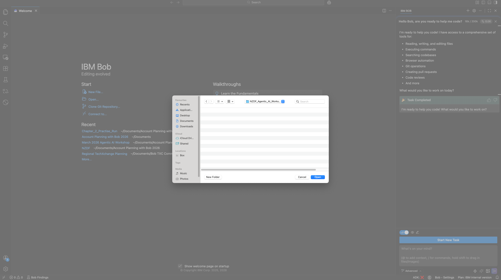
   
   - Name it: `NZDF_Agentic_AI_Workshop`
   
   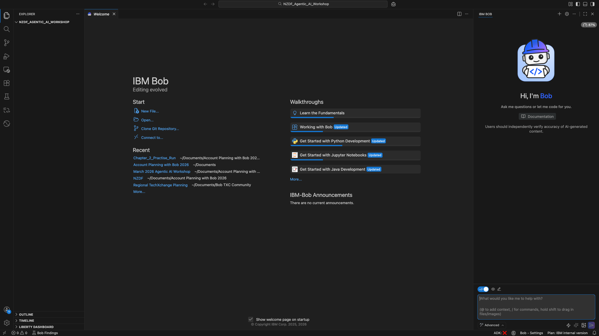

4. Open this folder in Bob by selecting it and clicking "Open"

**What this creates:**
- Location: `Documents/NZDF_Agentic_AI_Workshop/`
- Purpose: Store all code, configurations, and files from the workshop
- Structure: We'll organise files by chapter as we progress

**You should now see:**
- Bob's file explorer showing your new workshop folder
- The folder path displayed in Bob's interface

---

### Step 2: Prompt Bob to Generate Weather Tool (12 minutes)

Now we'll use Bob to generate our complete weather tool!

**Select the Right Mode:**

Before we start, make sure you're in **Code mode** (💻) in Bob. This mode is optimised for generating code and technical files.

- Look for the mode selector in Bob's interface
- Select **"💻 Code"** mode
- This ensures Bob provides production-ready code with proper structure

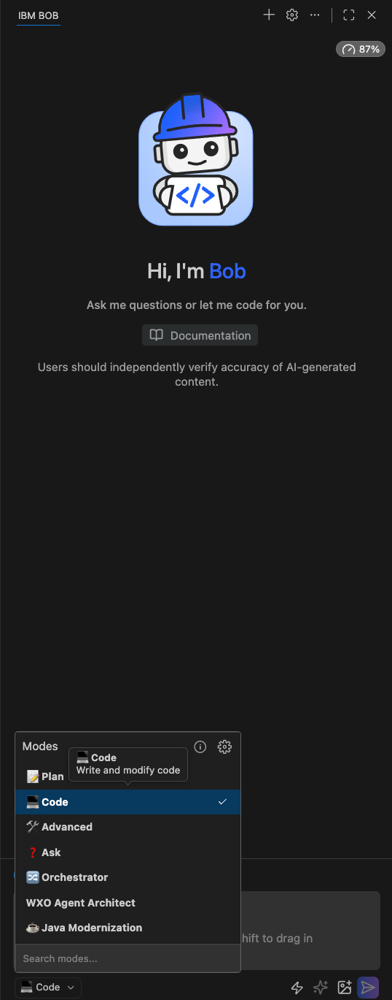

**Note:** Your Bob interface may show different available modes than the screenshot above, depending on your configuration and version. Look for the mode with the code/programming icon (💻) or labelled "Code".

#### Prompt 1: Generate the Python Tool

**Copy and paste this prompt to Bob:**

```
Create a Python tool for watsonx Orchestrate that retrieves weather data using the Open-Meteo API.

Requirements:
- API: Open-Meteo (https://api.open-meteo.com/v1/forecast)
- No API key required
- Function name: get_weather_forecast
- Input parameters:
  * latitude (float, required): Latitude coordinate
  * longitude (float, required): Longitude coordinate
  * forecast_days (int, optional, default=7): Number of forecast days
- Output: JSON with current weather and forecast
- Include these weather parameters:
  * Current: temperature_2m, relative_humidity_2m, wind_speed_10m, wind_direction_10m, weather_code
  * Daily: temperature_2m_max, temperature_2m_min, precipitation_sum, wind_speed_10m_max, weather_code
- Timezone: Pacific/Auckland
- Include error handling for:
  * Invalid coordinates
  * API connection failures
  * Timeout errors
- Return structured JSON output

Also include:
- Docstrings for the function
- Type hints
- Comments explaining key sections
```

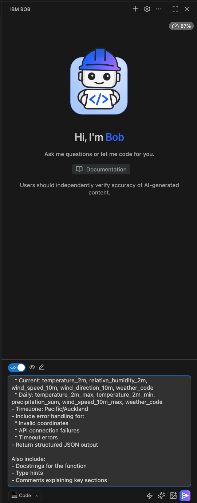

**What Bob will generate:**

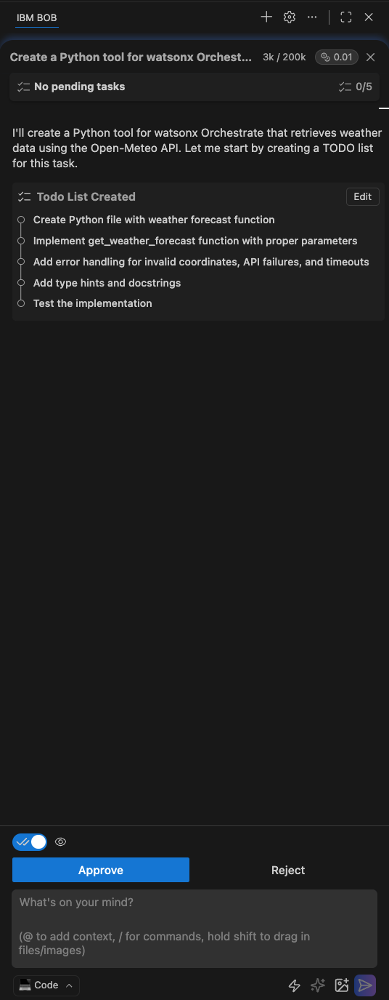

**Bob's Planning Process:**

Bob will typically start by creating a TODO list to plan the implementation:

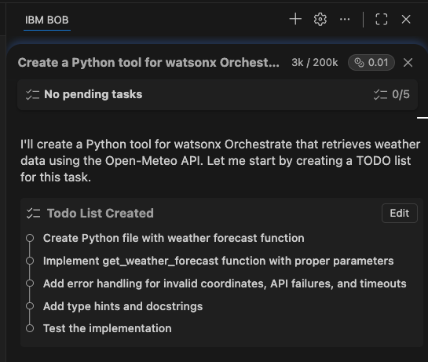

**Next Step:** Click **"Approve"** to let Bob walk you through the Python tool creation process. Bob will work through each item in the TODO list, creating the complete weather tool code. Simply follow the prompts that appear from Bob in the chat.

**Important Note:** Since Bob uses a Large Language Model (LLM) and is non-deterministic, Bob's response may vary. Sometimes Bob will:
- Create a detailed TODO list first (as shown above)
- Skip the planning steps and go straight to creating code
- Provide explanations before or after the code

All approaches are valid! The key is that Bob generates the complete, working Python code you need.

**Bob will create a Python file with:**
- Complete function implementation
- Error handling for all specified scenarios
- Type hints and comprehensive documentation
- Clean, production-ready code

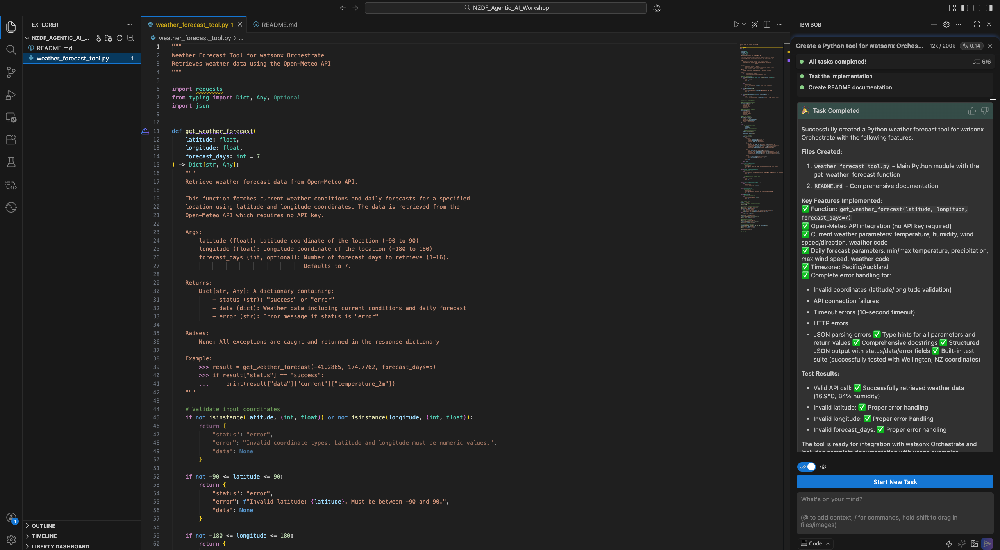

**Review the code Bob generates:**
- Check the function signature
- Verify error handling is included
- Ensure output format is JSON
- Look for any issues or improvements needed

**⚠️ Having Trouble?** If Bob didn't generate the code or you encountered issues, see the [Troubleshooting section](#-troubleshooting) below for instructions on using the pre-made tool.

#### Prompt 2: Generate the YAML Configuration

**Start a New Task:**

Before generating the YAML configuration, start a new task in Bob to keep the work organised:
- Click the **"New Task"** button or use the keyboard shortcut
- This ensures Bob focuses on the YAML generation without mixing contexts

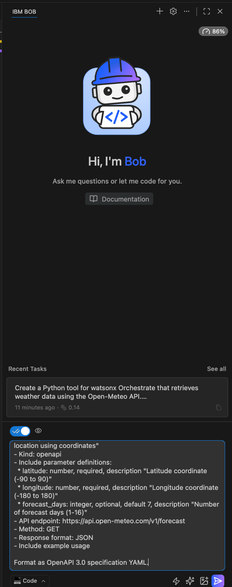

**Copy and paste this prompt to Bob:**

```
Create a YAML configuration file for watsonx Orchestrate to import the weather tool.

Requirements:
- Tool name: getWeatherForecast
- Description: "Retrieves current weather and forecast for a location using coordinates"
- Kind: openapi
- Include parameter definitions:
  * latitude: number, required, description "Latitude coordinate (-90 to 90)"
  * longitude: number, required, description "Longitude coordinate (-180 to 180)"
  * forecast_days: integer, optional, default 7, description "Number of forecast days (1-16)"
- API endpoint: https://api.open-meteo.com/v1/forecast
- Method: GET
- Response format: JSON
- Include example usage

Format as OpenAPI 3.0 specification YAML.
```

**What Bob will generate:**

**Note:** In this example, Bob goes straight to creating the YAML file without creating a planning TODO list first. This is normal behaviour - remember, Bob's LLM is non-deterministic and may skip the planning phase for simpler tasks.

Bob should create a YAML file with:
- OpenAPI specification
- Complete parameter definitions
- Example requests and responses
- Clear documentation

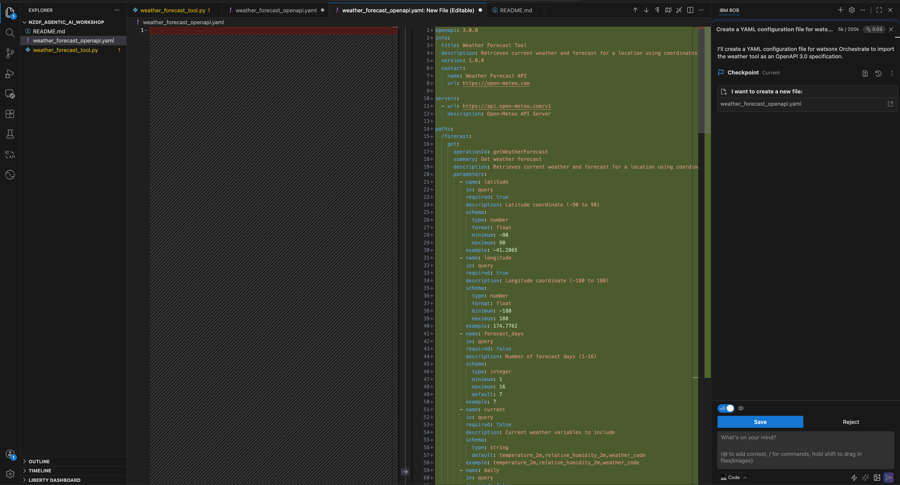

**Save the files:**

Bob will suggest filenames for both files. Accept Bob's suggested names or use your own:
- Python file: Bob may suggest names like `weather_forecast_tool.py`, `maritime_weather_tool.py`, or similar
- YAML file: Bob may suggest names like `weather_tool_openapi.yaml`, `OpenMeteo_Tool_OpenAPI_Spec.yaml`, or similar

**Tip:** The exact filenames don't matter as long as they're descriptive. You'll reference them when importing to Orchestrate.

**⚠️ Having Trouble?** If Bob didn't generate the code or you encountered issues, see the [Troubleshooting section](#-troubleshooting) below for instructions on using the pre-made tool.

---

### Step 3: Understanding the Generated Code (3 minutes)

Let's review what Bob created:

#### Key Components in the Python Code

```python
def get_weather_forecast(latitude: float, longitude: float, forecast_days: int = 7):
    """
    Retrieves weather forecast for given coordinates
    """
    # 1. Validate inputs
    # 2. Build API request
    # 3. Make API call
    # 4. Parse response
    # 5. Return structured data
```

#### Key Components in the YAML

```yaml
openapi: 3.0.0
info:
  title: Maritime Weather Tool
  version: 1.0.0
paths:
  /forecast:
    get:
      parameters:
        - name: latitude
        - name: longitude
        - name: forecast_days
```

**Discussion Points:**
- How does error handling work?
- What happens if coordinates are invalid?
- How is the JSON structured?
- What weather codes mean what conditions?

---

### Step 4: Configure Your ADK Environment (5 minutes)

Before importing tools, you need to configure your ADK environment to connect to watsonx Orchestrate.

**Prerequisites:**
- ✅ You must have completed **Step 7** in [Chapter 0: Environment Setup](./Chapter_0_Environment_Setup.md)
- ✅ Ensure your virtual environment is activated:
  - **macOS/Linux:** `source ./.venv/bin/activate`
  - **Windows:** `.venv\Scripts\activate`
- ✅ Verify ADK is installed: `orchestrate --version`

**Steps:**

1. **Log in to your watsonx Orchestrate instance**

2. **Access Settings:**
   - Click your user icon on the top right
   - Click **Settings**

   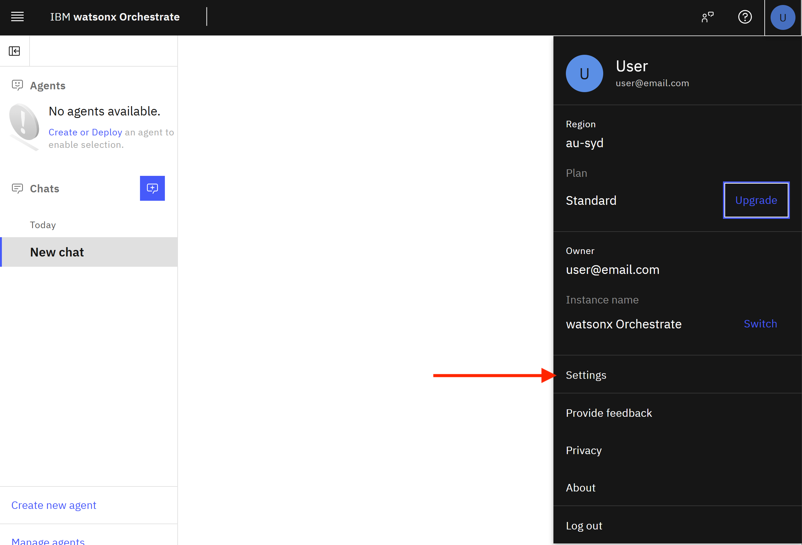

3. **Go to the API details tab**

4. **Copy the service instance URL:**

   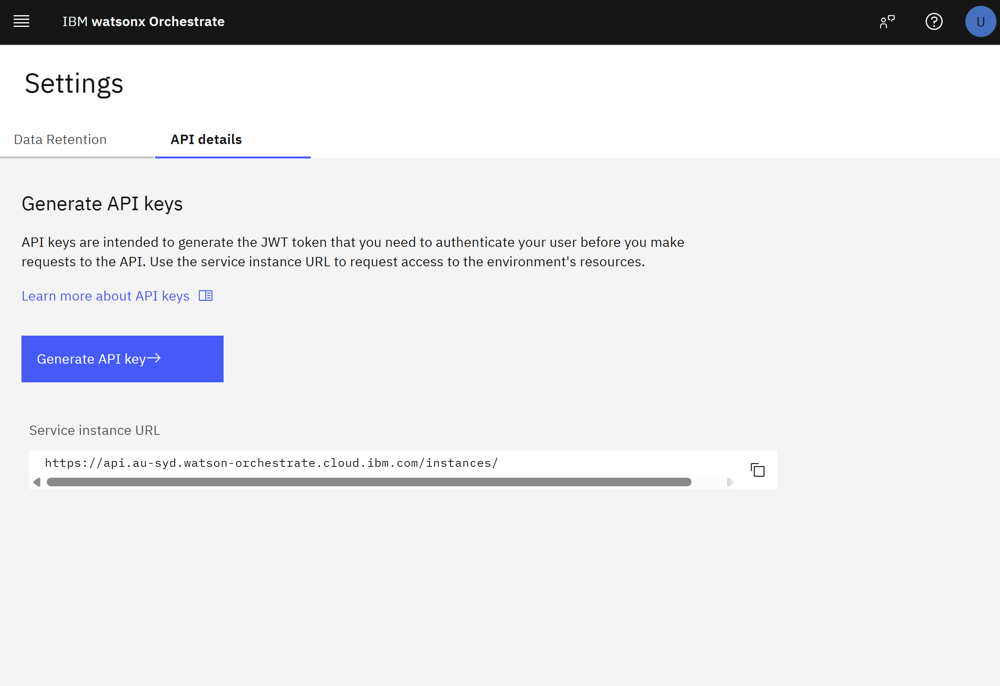

5. **Get your API key:**
   - Use the API key you generated earlier in Chapter 0, Step 5

6. **Open a terminal in Bob:**
   - In Bob, you can open an integrated terminal to run commands
   - This allows you to execute ADK commands directly within Bob's interface
   - Look for the terminal option in Bob's menu or use the keyboard shortcut

7. **Add and activate your environment with the ADK CLI:**

   ```bash
   orchestrate env add --name <environment-name> -u <service-instance-url> --type ibm_iam --activate
   ```

   **Note:** You can set any name you prefer for the environment. The `--name` (or `-n`) flag is required.

   **Example:**
   ```bash
   orchestrate env add --name workshop -u https://api.watsonx-orchestrate.ibm.com/v1 --type ibm_iam --activate
   ```
   
   Or using the short form:
   ```bash
   orchestrate env add -n workshop -u https://api.watsonx-orchestrate.ibm.com/v1 --type ibm_iam --activate
   ```

   **Success message:**
   ```
   Environment 'workshop' has been created
   ```

8. **When prompted, enter your API key and press Enter**

   **Success message:**
   ```
   Active workspace: Global workspace
   ```

9. **Verify your environment is active:**
   ```bash
   orchestrate env list
   ```

   You should see your environment marked as active (with an asterisk *).

   **Example output:**
   ```
   workshop               https://api.us-south.watson-orchestrate.cloud.ibm.com/instances/<your-instance-id>  (active)
   ```

---

### Step 5: Import Tool to Orchestrate (3 minutes)

Now let's import Bob's creation into watsonx Orchestrate!

#### Understanding OpenAPI Tool Requirements

Before importing, ensure your OpenAPI specification meets these requirements:
- ✅ OpenAPI version 3.0
- ✅ Endpoints accept and return JSON
- ✅ Includes a `servers` block with exactly one URL (no parameterization)
- ✅ Each path has an `operationId` (becomes the tool name - use snake_case)
- ✅ Each path has a clear `description` (helps the agent understand when to use the tool)

**Example minimal OpenAPI structure:**
```yaml
servers:
  - url: https://api.open-meteo.com/v1
paths:
  /forecast:
    get:
      operationId: get_weather_forecast
      description: "Retrieves current weather and forecast for a location using coordinates"
      parameters:
        # ... parameter definitions
      responses:
        # ... response definitions
```

#### Using the CLI

1. **Identify your OpenAPI spec filename:**
   
   Bob may have created the YAML file with different names. Common names include:
   - `weather_forecast_openapi.yaml`
   - `OpenMeteo_Tool_OpenAPI_Spec.yaml`
   - `weather_tool_openapi.yaml`
   
   **List your files to find the correct name:**
   ```bash
   ls *.yaml
   ```
   
   Look for the weather tool OpenAPI specification file you created in Step 2.
   
   **Important:** Use the actual filename in the commands below. The examples use `weather_forecast_openapi.yaml`, but replace this with your actual filename.

2. **Verify your environment is properly configured:**
   ```bash
   orchestrate env list
   ```
   
   Ensure your environment shows as active with a valid URL.

3. **Import the OpenAPI tool:**
   ```bash
   orchestrate tools import -k openapi -f weather_forecast_openapi.yaml
   ```
   
   **⚠️ Replace `weather_forecast_openapi.yaml` with your actual filename!**
   
   If Bob created a file with a different name (e.g., `OpenMeteo_Tool_OpenAPI_Spec.yaml`), use that name instead:
   ```bash
   orchestrate tools import -k openapi -f OpenMeteo_Tool_OpenAPI_Spec.yaml
   ```
   
   **Command flags explained:**
   - `-k openapi` or `--kind openapi`: Specifies this is an OpenAPI-based tool
   - `-f <file-path>` or `--file <file-path>`: Path to your OpenAPI specification file
   
   **Note:** You can optionally specify an app ID with `-a <app-id>` if you want to associate the tool with a specific application.
   
   **⚠️ Common Issues:**
   
   - **Wrong filename**: Make sure you're using the actual YAML filename Bob created (check with `ls *.yaml`)
   - **Wrong directory**: Ensure you're in the directory where the YAML file is located
   - **Environment not configured**: If you get environment errors, verify Step 4 was completed correctly

4. **Verify import via CLI:**
   ```bash
   orchestrate tools list | grep getWeatherForecast
   ```

   You should see:
   ```
   getWeatherForecast    openapi    Active    [timestamp]
   ```

5. **Verify import in watsonx Orchestrate UI:**
   
   Let's confirm the tool is available in the Orchestrate interface:
   
   1. **Open watsonx Orchestrate** in your browser
   
   2. **Click the hamburger menu** (☰) on the top left corner
   
   3. **Select "Build"** from the menu
   
   4. **Click "All tools"** in the left-hand menu
   
   You should see your newly imported weather tool:
   
   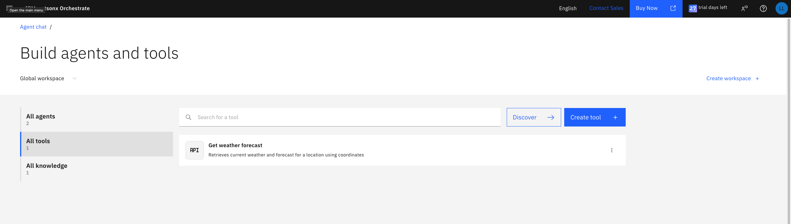
   
   The tool should show:
   - **Name:** getWeatherForecast
   - **Type:** openapi
   - **Status:** Active
   - **Description:** Retrieves current weather and forecast for a location using coordinates

#### Important Considerations for OpenAPI Tools

**Limitations to be aware of:**
- OpenAPI endpoints are designed for developers, not agents - ensure your descriptions are clear and complete
- Agents need all context within the endpoint itself (they can't rely on external documentation)
- Large sets of input arguments can confuse agents - keep tools focused on single tasks

**Best practices:**
- Use descriptive `operationId` values in snake_case (e.g., `get_weather_forecast`)
- Write clear, detailed descriptions that explain the tool's purpose to an LLM
- Keep input parameters focused and well-documented
- Ensure your API returns structured JSON responses

---

### Step 6: Create Maritime Weather Agent (5 minutes)

Now let's create an agent that uses our new tool!

#### Create the Agent

```bash
orchestrate agents create \
  --name maritime_weather_agent \
  --description "AI agent for maritime weather intelligence for NZDF operations" \
  --tools getWeatherForecast
```

**Success message:**
```
Agent 'maritime_weather_agent' imported successfully
```

#### Configure Agent with Bob

Now let's use Bob to create a complete agent configuration file!

**Start a New Task in Bob:**
- Click the **"New Task"** button to start fresh
- This keeps the agent configuration work separate from the tool creation

**Prompt Bob to create the agent configuration:**

Copy and paste this prompt to Bob:

```
Create a YAML agent configuration file for watsonx Orchestrate with the following specifications:

Use this exact structure:

spec_version: v1
kind: native
name: maritime_weather_agent
display_name: maritime_weather_agent
description: "AI agent for maritime weather intelligence for NZDF operations"
llm: groq/openai/gpt-oss-120b
style: default
hide_reasoning: false
memory_enabled: false
restrictions: editable
instructions: |
  [INSTRUCTIONS GO HERE]
guidelines: []
collaborators: []
tools:
  - getWeatherForecast
knowledge_base: []
context_access_enabled: false
context_variables: []

Replace [INSTRUCTIONS GO HERE] with these instructions:

You are a maritime weather intelligence assistant for NZDF operations.

Use getWeatherForecast to get weather data for locations.

CRITICAL: Convert city names to coordinates:
- Wellington: latitude=-41.2865, longitude=174.7762
- Auckland: latitude=-36.8485, longitude=174.7633
- Christchurch: latitude=-43.5321, longitude=172.6362
- Dunedin: latitude=-45.8788, longitude=170.5028

Always include these parameters when calling getWeatherForecast:
- current: temperature_2m,relative_humidity_2m,wind_speed_10m,wind_direction_10m,weather_code
- daily: weather_code,temperature_2m_max,temperature_2m_min,precipitation_sum,wind_speed_10m_max
- timezone: Pacific/Auckland
- forecast_days: 7

Interpret weather codes and present them naturally:
- When you receive weather_code values, translate them to plain language descriptions
- NEVER mention the numeric weather code in your response
- Use natural descriptions like "clear sky", "partly cloudy", "rain", etc.
- Weather code meanings: 0=Clear sky, 1-3=Partly cloudy, 45-48=Fog, 51-55=Drizzle, 61-65=Rain, 71-75=Snow, 80-82=Rain showers, 95-99=Thunderstorm

Provide clear, actionable intelligence for maritime operations including:
1. Current conditions (temperature, wind, weather)
2. Forecast summary
3. Operational recommendations (safe/caution/unsafe)
4. Specific hazards or concerns

Save the file as: maritime_weather_agent.yaml

Do NOT provide CLI commands - I will use the commands from the guide.
```

**What Bob will do:**
1. Create the `maritime_weather_agent.yaml` file with complete agent configuration

**Import the agent:**

Once Bob creates the YAML file, use this exact command to import it:

```bash
orchestrate agents import -f maritime_weather_agent.yaml
```

**Command flags explained:**
- `-f` or `--file`: Path to the agent configuration YAML file

**Success messages:**

If this is a new agent:
```
Agent 'maritime_weather_agent' imported successfully
```

If the agent already exists (updating):
```
Existing Agent 'maritime_weather_agent' found. Updating...
[INFO] - Agent 'maritime_weather_agent' updated successfully
```

**Verify the agent in watsonx Orchestrate UI:**

1. **Open watsonx Orchestrate** in your browser

2. **Click the hamburger menu** (☰) on the top left corner

3. **Select "Build"** from the menu

   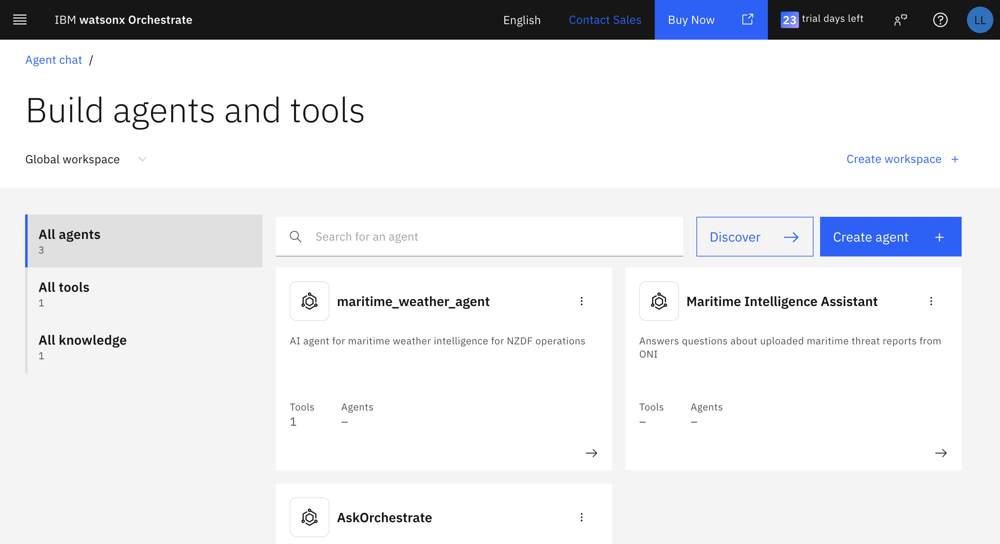

4. **Select the `maritime_weather_agent`** from the agents list

5. **Scroll down or click on the "Behaviour" tab** on the left-hand side

6. **Verify that the instructions have been updated** with the weather code interpretation rules

   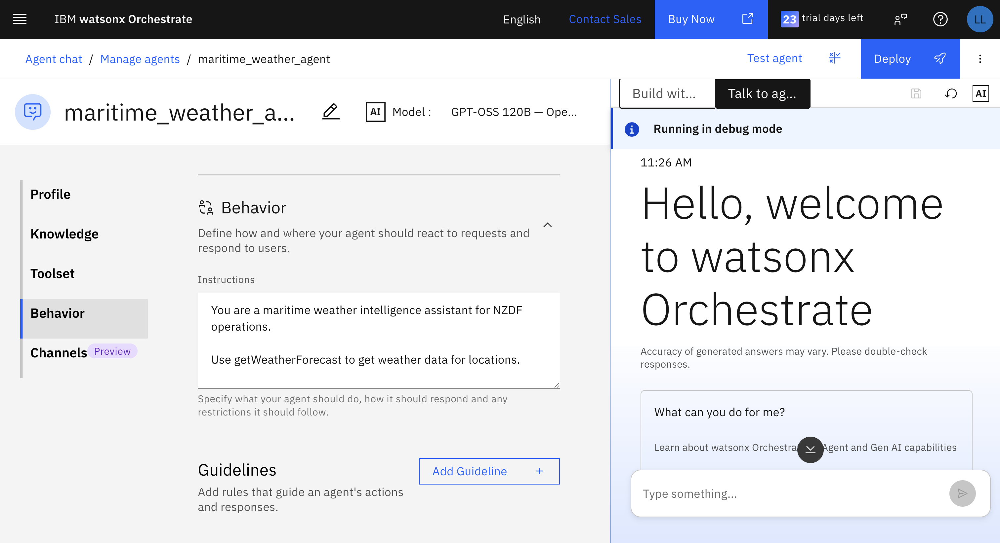

You should see the agent instructions including:
- City coordinate mappings
- Weather code interpretation rules
- "NEVER mention the numeric weather code in your response"

**Note:** If you need to update the agent later (after making changes to the YAML file), use:

```bash
orchestrate agents update --name maritime_weather_agent -f maritime_weather_agent.yaml
```

**⚠️ Important:** Don't ask Bob for the CLI commands - use the exact commands shown above. Bob may suggest variations that don't match the ADK CLI syntax.

---

### Step 7: Test Your Agent (5 minutes)

Time to see Bob's creation in action!

#### Test in Orchestrate UI

1. **Open watsonx Orchestrate UI**

2. **Navigate to your agent:** `maritime_weather_agent`

3. **Open the chat interface**

#### Test Query 1: Simple Weather Request

**Type:**
```
What's the current weather in Wellington?
```

**Expected behaviour:**
- ✅ Agent converts "Wellington" to coordinates (-41.2865, 174.7762)
- ✅ Calls getWeatherForecast tool
- ✅ Returns current temperature, wind, conditions
- ✅ Response time < 3 seconds

**Sample response:**
```
Current weather in Wellington:
- Temperature: 16°C
- Wind: 25 km/h from SW
- Conditions: Partly cloudy
- Humidity: 72%

Operational Assessment: SAFE - Moderate winds, good visibility
```

#### Test Query 2: Forecast Request

**Type:**
```
Give me a 7-day forecast for Auckland
```

**Expected behaviour:**
- ✅ Agent converts "Auckland" to coordinates
- ✅ Returns daily forecast
- ✅ Includes max/min temps, precipitation, wind

#### Test Query 3: Operational Assessment

**Type:**
```
Is it safe to operate vessels near Wellington today?
```

**Expected behaviour:**
- ✅ Agent analyses weather data
- ✅ Provides safety assessment
- ✅ Gives operational recommendations
- ✅ Highlights any hazards

---

## 🎓 Key Takeaways

### What You Just Accomplished

1. ✅ **Used AI to generate code** - Bob created production-ready Python in seconds
2. ✅ **Created configuration files** - Bob generated proper YAML specs
3. ✅ **Deployed to production** - Tool works in Orchestrate immediately
4. ✅ **Built real capability** - Actual weather intelligence for operations

### The Power of AI-Assisted Development

**Traditional Approach:**
- 2-3 hours to research APIs
- 2-3 hours to write code
- 1 hour to create configs
- 1 hour to test
- **Total: 6-8 hours**

**With Bob:**
- 5 minutes to prompt Bob
- 5 minutes to review code
- 3 minutes to import
- 2 minutes to test
- **Total: 15 minutes**

**Result: 30x faster development!**

---

## 🔧 Troubleshooting

### Issue: Bob didn't generate the code or you had trouble

**Solution: Use the Pre-Made Tools**

If you encountered issues with Bob generating the code, you can use the pre-made tools provided in the workshop materials:

**Pre-made files available:**
- Python tool: `GitHub_Bootcamp_Guide/assets/chapter-2/weather_forecast_tool.py`
- YAML config: `GitHub_Bootcamp_Guide/assets/chapter-2/weather_forecast_openapi.yaml`

**Option 1: Copy files using Bob**
1. In Bob, navigate to `GitHub_Bootcamp_Guide/assets/chapter-2/`
2. Open both files
3. Copy each file to your workshop folder: `~/Documents/NZDF_Agentic_AI_Workshop/`

**Option 2: Copy files using command line**
```bash
# Navigate to your workshop folder
cd ~/Documents/NZDF_Agentic_AI_Workshop

# Copy both pre-made files
cp /path/to/GitHub_Bootcamp_Guide/assets/chapter-2/weather_forecast_tool.py .
cp /path/to/GitHub_Bootcamp_Guide/assets/chapter-2/weather_forecast_openapi.yaml .
```

**Verify the files:**
- Open both files in Bob or your text editor
- Python file should contain the `get_weather_forecast` function
- YAML file should contain the OpenAPI specification
- You can now proceed with importing the tool to Orchestrate

**Note:** The pre-made tools are identical to what Bob would generate, so you won't miss any functionality.

---

### Issue: Tool import fails

**Solution:**
```bash
# Check YAML syntax
cat OpenMeteo_Tool_OpenAPI_Spec.yaml

# Verify authentication
orchestrate env list

# Try reimporting
orchestrate tools import --kind openapi --file OpenMeteo_Tool_OpenAPI_Spec.yaml
```

### Issue: Agent doesn't call tool

**Solution:**
- Verify tool is in agent's tool list
- Check agent instructions include coordinate mappings
- Try more explicit query: "Use the weather tool to check Wellington"

### Issue: Invalid coordinates error

**Solution:**
- Verify coordinates are in correct format (decimal degrees)
- Check latitude is between -90 and 90
- Check longitude is between -180 and 180

### Issue: Slow API responses

**Solution:**
- Open-Meteo is usually fast (< 2s)
- Check internet connection
- Try again (may be temporary)

---

## 💡 Pro Tips

### 1. Prompting Bob Effectively

**Good prompts include:**
- Clear requirements
- Specific technologies
- Error handling needs
- Output format expectations
- Example use cases

**Example:**
```
"Create a Python function that [specific task] using [specific API].
Include error handling for [scenarios].
Return [format] with [specific fields]."
```

### 2. Reviewing Bob's Code

Always check:
- Error handling is comprehensive
- Type hints are included
- Documentation is clear
- Code follows best practices
- Security considerations are addressed

### 3. Iterating with Bob

If the first output isn't perfect:
```
"Bob, can you modify the code to also include [new requirement]?"
"Bob, add better error messages for [scenario]"
"Bob, optimise this for [specific use case]"
```

---

## 📊 NZ City Coordinates Reference

Keep this handy for testing:

| City | Latitude | Longitude |
|------|----------|-----------|
| Wellington | -41.2865 | 174.7762 |
| Auckland | -36.8485 | 174.7633 |
| Christchurch | -43.5321 | 172.6362 |
| Dunedin | -45.8788 | 170.5028 |
| Hamilton | -37.7870 | 175.2793 |
| Tauranga | -37.6878 | 176.1651 |
| Napier | -39.4902 | 176.9120 |
| Palmerston North | -40.3523 | 175.6082 |

---

## 🌤️ Weather Code Reference

For interpreting responses:

| Code | Condition | Maritime Impact |
|------|-----------|-----------------|
| 0 | Clear sky ☀️ | Excellent visibility |
| 1-3 | Partly cloudy ☁️ | Good conditions |
| 45-48 | Fog 🌫️ | Reduced visibility |
| 51-55 | Drizzle 🌦️ | Minor impact |
| 61-65 | Rain 🌧️ | Moderate impact |
| 71-75 | Snow ❄️ | Significant impact |
| 80-82 | Rain showers 🌧️ | Variable conditions |
| 95-99 | Thunderstorm ⛈️ | Dangerous conditions |

---

## 🎯 Success Criteria

You've successfully completed Part A if:

- ✅ Bob generated working Python code
- ✅ Bob created valid YAML configuration
- ✅ Tool imported successfully to Orchestrate
- ✅ Agent uses tool correctly
- ✅ Test queries return accurate weather data
- ✅ Response time < 3 seconds

---

## 🚀 What's Next?

In **Part B** (News Integration), you'll:
- Use Bob to create an RSS news parser
- Monitor maritime news sources
- Combine weather + news intelligence
- Build multi-source situational awareness

**The Evolution:**
```
Part A: Weather data (automated)
         ↓
Part B: + News monitoring (automated)
         ↓
Part C: + Automated reporting
         ↓
Complete Maritime Intelligence System
```

---

## 📚 Additional Resources

### Open-Meteo Documentation
- [API Documentation](https://open-meteo.com/en/docs)
- [Weather Variables](https://open-meteo.com/en/docs#weathervariables)
- [Marine Forecast](https://open-meteo.com/en/docs/marine-weather-api)

### IBM Bob Resources
- [Bob Documentation](https://www.ibm.com/products/watsonx-code-assistant)
- [Prompting Best Practices](./reference/Bob_Prompting_Guide.md)
- [Code Review Checklist](./reference/Bob_Code_Review.md)

### Sample Queries to Try

```
1. What's the weather in Wellington?
2. Give me a 7-day forecast for Auckland
3. What are current conditions in Christchurch?
4. Is it safe to operate vessels near Wellington today?
5. Give me a SITREP for Wellington maritime operations
6. What's the wind speed in Auckland right now?
7. Compare weather in Wellington and Auckland
8. What's the 7-day forecast for Christchurch?
```

---

**Chapter Author:** Libby Lavrova  
**Last Updated:** May 5, 2026  
**Version:** 1.0  
**Estimated Time:** 25 minutes  
**Difficulty:** ⭐⭐ Intermediate

---

[← Back to Chapter 1](./Chapter_1_Your_First_AI_Assistant.md) | [Back to Main Guide](../README.md) | [Next: Chapter 3 →](./Chapter_3_RSS_Feed_Integration.md)