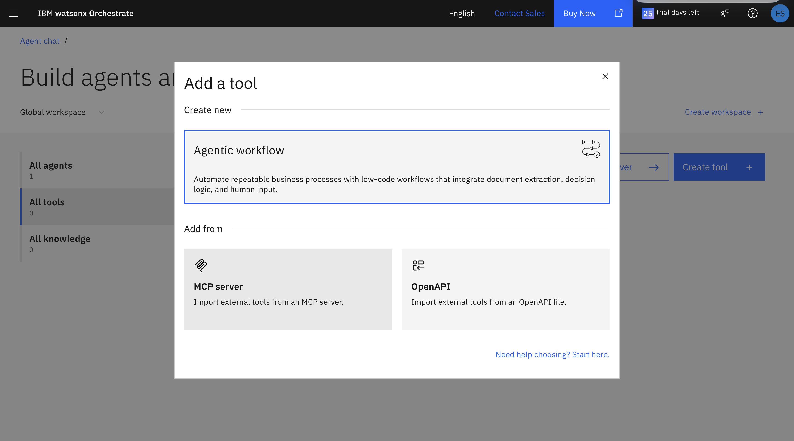

# Chapter 3: RSS Feed Integration with Langflow

**Time:** 2:30 PM - 3:15 PM (45 minutes)
**Goal:** Build a Langflow workflow that extracts structured maritime incidents from RSS feeds

---

## 🎯 Learning Objectives

By the end of this chapter, you will:

1. ✅ Build a working Langflow pipeline using visual blocks
2. ✅ Pull live RSS content with the Python Interpreter block
3. ✅ Convert raw Python output into a message Langflow can pass downstream
4. ✅ Use a prompt template to enforce structured maritime extraction
5. ✅ Configure an agent to return incident JSON for downstream workflows

---

## 📖 What We're Building

A Langflow workflow that reads a maritime RSS feed and transforms it into structured incident data for later use in watsonx Orchestrate, reporting, or visualisation.

### Block sequence

`Python Interpreter → Type Convert → Prompt Template → Agent → Chat Output`

### What the workflow does

- Pulls XML content from a live maritime RSS feed
- Passes the raw feed into a prompt as input text
- Uses an LLM agent to extract incident details
- Returns structured JSON
- Sends the result to chat output for testing in Langflow

---

## 🖼️ Chapter 3 Reference Image

Use this screenshot as the visual reference while recreating the flow in Langflow:


---

## 🧱 Langflow Blocks and Connections

Build the flow in this exact order:

1. **Python Interpreter**
2. **Type Convert**
3. **Prompt Template**
4. **Agent**
5. **Chat Output**

### Connections

- Connect the `Results` output from **Python Interpreter** to the `Input` of **Type Convert**
- Connect the `Message Output` from **Type Convert** to the `rss_feed` variable input on **Prompt Template**
- Connect the `Prompt` output from **Prompt Template** to the `Input` on **Agent**
- Connect the `Response` output from **Agent** to **Chat Output**

This creates a linear extraction pipeline from RSS collection through to final structured output.

---

## 🚀 Step 1: Create the Langflow Flow

1. Open Langflow
2. Create a new blank flow
3. Add the following blocks to the canvas:
   - **Python Interpreter**
   - **Type Convert**
   - **Prompt Template**
   - **Agent**
   - **Chat Output**
4. Arrange them left to right so the flow is easy to follow

---

## 🐍 Step 2: Configure the Python Interpreter Block

Add `requests` to the **Global Imports** field.

### Global Imports

```text
requests
```

### Python Code

```python
import requests

url = "https://ethanmark7.github.io/rss_feed/rss.xml"
headers = {
    "User-Agent": (
        "Mozilla/5.0 (Windows NT 10.0; Win64; x64) "
        "AppleWebKit/537.36 (KHTML, like Gecko) "
        "Chrome/136.0 Safari/537.36"
    )
}

response = requests.get(url, headers=headers, timeout=30)
print("Status:", response.status_code)
print(response.text[:20000])
```

### What this block does

- Imports the `requests` library
- Fetches the Cruise Law News RSS feed
- Adds a browser-style user agent header
- Prints the HTTP status
- Prints up to the first 20,000 characters of the feed so the downstream blocks can process it

### Try running it

Run the workflow to see the result - you should see a successful HTTP status such as `200` and raw RSS/XML content in the output.

---

## 🔁 Step 3: Configure the Type Convert Block

The Python Interpreter output needs to be converted into a message before it can be injected cleanly into the prompt workflow.

### Configuration

- **Input:** Connect from Python Interpreter `Results`
- **Output Type:** `Message`

### Why this matters

This makes the Python output compatible with the variable input expected by the prompt block.

---

## 🧠 Step 4: Configure the Prompt Template Block

Create a prompt template with one dynamic variable:

- `rss_feed`

Paste the following into the template field.

```text
You are a maritime incident extraction system.

Extract structured incident data from an RSS feed item.

Return ONLY valid JSON.

Rules:
- Do not invent data
- Use null if missing
- If no incident exists, return: "incident_detected": false
- If multiple incidents exist, return a JSON array

Also extract up to 3 image URLs from the article content:
- Look for images in <content:encoded>, <description>, or 
- Return only direct image URLs
- Ignore icons, tracking pixels, and logos
- Must be different, varying image size is not helpful take the biggest 3 different

Return format:
[
  {
    "incident_detected": true,
    "date": "",
    "title": "",
    "incident_type": "collision | grounding | piracy | fire | machinery failure | pollution | weather | port disruption | security | other",
    "location": "",
    "incident_description": "",
    "vessels_involved": [
      {
        "name": "",
        "type": ""
      }
    ],
    "casualties": {
      "deaths": 0,
      "injured": 0,
      "missing": 0
    },
    "environmental_impact": "",
    "source": "",
    "images": [
      "",
      "",
      ""
    ],
    "confidence": "high | medium | low"
  }
]

There can be more than 1 return all of the incidents given in the RSS feed following the above format.

RSS input:
{rss_feed}
```

### What this block does

- Frames the extraction task
- Constrains the output to JSON only
- Defines the expected schema
- Passes live RSS content through the `{rss_feed}` variable

---

## 🤖 Step 5: Configure the Agent Block

Use the prompt output as the agent input.

### Agent settings

- **Language Model:** `ibm/granite-4-h-small`
- **Agent Instructions:**

```text
Your role is to analyse RSS feed notifications and extract structured maritime incident information.
```

- **Max Iterations:** `15`

### Agent input connection

Connect the `Prompt` output from **Prompt Template** into the **Input** on **Agent**.

### Why this configuration works

- The model receives the fully rendered prompt plus RSS content
- The instructions reinforce the extraction role
- Higher iteration count gives the agent room to complete the task reliably

---

## 💬 Step 6: Connect Chat Output

Connect the `Response` output from **Agent** to **Chat Output**.

This lets you test the flow directly inside Langflow and inspect the returned JSON.

---

## 🧪 Step 7: Test the Full Flow

Run the flow and verify the following:

- The Python block successfully fetches the RSS feed
- The Type Convert block passes a message downstream
- The Prompt Template receives the `rss_feed` variable correctly
- The Agent returns valid JSON
- The Chat Output displays extracted incident data

### Good test indicators

- Maritime incident titles appear in the JSON
- Incident types are classified into the allowed categories
- Missing values are `null` or empty only where appropriate
- Image URLs are direct links, not logos or trackers
- Multiple incidents return as an array

---

## 🔗 Step 8: Connect Langflow to watsonx Orchestrate

Now that your Langflow workflow is working, let's make it available as a tool in watsonx Orchestrate.

### 8.1: Share as MCP Server

1. In Langflow, click the **Share** button in the top right
2. Select **MCP Server** from the sharing options



3. Copy the MCP server URL - it should look like:
   ```
   https://langflow.example.codeengine.appdomain.cloud/api/v1/mcp/project/YOUR-PROJECT-ID/streamable
   ```

### 8.2: Add MCP Server to Orchestrate

1. Go back to your watsonx Orchestrate project
2. Navigate to **Tools** section
3. Click **Create Tool**


4. Select **Add from MCP server**
5. Click **Add MCP server**
6. Choose **Remote MCP server**


7. Give your server a name (e.g., "Maritime RSS Feed Extractor")
8. Paste in the MCP server URL you copied from Langflow
9. Click **Connect**


10. Click **Done** to add the tool to your project

### 8.3: Create or Update an Agent

1. Go to **Agents** in your Orchestrate project
2. Either create a new agent or open an existing one


3. Click **Manage Agents** if editing an existing agent


4. Add the RSS feed tool you just created to your agent's available tools
5. Save the agent configuration

### 8.4: Test the Integration

1. Open the agent chat interface
2. Ask: "What are the latest maritime news updates?"
3. The agent should use your Langflow tool to fetch and extract RSS feed data
4. Verify the agent returns structured maritime incident information

---

## 🖼️ Reference Architecture

Use this build order when recreating the flow:

1. **Python Interpreter**
2. **Type Convert**
3. **Prompt Template**
4. **Agent**
5. **Chat Output**

Flow summary:

- **Python Interpreter** fetches the RSS XML
- **Type Convert** turns the result into a message
- **Prompt Template** injects the feed into the extraction instructions
- **Agent** runs the structured extraction with `ibm/granite-4-h-small`
- **Chat Output** shows the final result

---

## 🔧 Troubleshooting

### Problem: Python block fails
Check that `requests` is listed in **Global Imports** and that the code is pasted exactly.

### Problem: No RSS content returned
Verify the feed URL is reachable and that the request is not being blocked.

### Problem: Prompt block stays empty
Make sure the **Type Convert** block output type is set to `Message` and connected to the `rss_feed` input.

### Problem: Agent returns prose instead of JSON
Confirm the prompt says `Return ONLY valid JSON` and that the model is set to `ibm/granite-4-h-small`.

### Problem: Bad image links
The model may still surface noisy links from article HTML. Re-run and validate that the returned URLs are direct image assets.

---

## 📊 Success Criteria

You've successfully completed Chapter 3 if:

- ✅ The Langflow workflow runs end to end
- ✅ RSS content is fetched from the GitHub Pages feed
- ✅ The prompt receives the feed content through `rss_feed`
- ✅ The agent returns structured maritime incident JSON
- ✅ Output is visible in Chat Output
- ✅ The workflow is shared as an MCP server
- ✅ The MCP server is added as a tool in watsonx Orchestrate
- ✅ An agent can successfully use the tool to fetch maritime news

---

## 🎓 Key Takeaway

This chapter shows how Langflow can turn a live RSS feed into structured maritime intelligence using a simple visual chain of blocks instead of a large custom application.

---

## 📚 Next Step

After this chapter, you can use the extracted incident JSON in:

- reporting workflows
- dashboard generation
- downstream agent tools
- maritime alerting pipelines

---

[← Back to Chapter 2](./Chapter_2_Document_Analysis_Agent.md) | [Back to Main Guide](../README.md) | [Next: Chapter 4 →](./Chapter_4_Visualisation_with_Bob.md)