# Chapter 3: RSS Feed Integration with Langflow

**Time:** 2:30 PM - 3:15 PM (45 minutes)
**Goal:** Build a Langflow workflow that extracts structured maritime incidents from RSS feeds

---

## 🎯 Learning Objectives

By the end of this chapter, you will:

1. ✅ Build a working Langflow pipeline using visual blocks
2. ✅ Pull live RSS content with the Python Interpreter block
3. ✅ Convert raw Python output into a message Langflow can pass downstream
4. ✅ Use a prompt template to enforce structured maritime extraction
5. ✅ Configure a language model to return incident JSON for downstream workflows

---

## 🔗 Access Langflow

Click here to access the Langflow environment for this workshop:

**[Open Langflow](https://langflow.29hoasy3dp25.us-south.codeengine.appdomain.cloud/)**

---

## 📖 What We're Building

A Langflow workflow that reads a maritime RSS feed and transforms it into structured incident data for later use in watsonx Orchestrate, reporting, or visualisation.

### Block sequence

`Python Interpreter → Type Convert → Prompt Template → Language Model → Chat Output`

### What the workflow does

- Pulls XML content from a live maritime RSS feed
- Passes the raw feed into a prompt as input text
- Uses an LLM to extract incident details
- Returns structured JSON
- Sends the result to chat output for testing in Langflow

---

## 🖼️ Chapter 3 Reference Image

Use this screenshot as the visual reference while recreating the flow in Langflow:

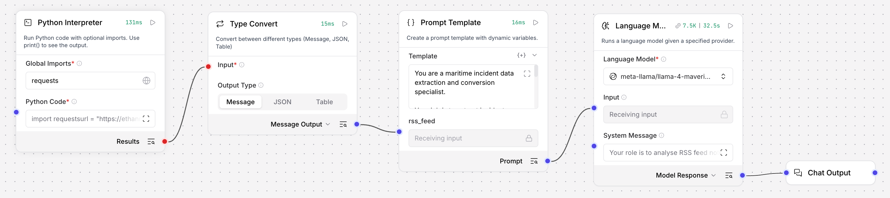

---

## 🧱 Langflow Blocks and Connections

Build the flow in this exact order:

1. **Python Interpreter**
2. **Type Convert**
3. **Prompt Template**
4. **Language Model**
5. **Chat Output**

### Connections

- Connect the `Results` output from **Python Interpreter** to the `Input` of **Type Convert**
- Connect the `Message Output` from **Type Convert** to the `rss_feed` variable input on **Prompt Template**
- Connect the `Prompt` output from **Prompt Template** to the `Input` on **Language Model**
- Connect the `Response` output from **Language Model** to **Chat Output**

This creates a linear extraction pipeline from RSS collection through to final structured output.

---

## 🚀 Step 1: Create the Langflow Flow

1. Open Langflow
2. Create a new blank flow
3. Set name to [your initials]_maritime_rss_flow (e.g. es_maritime_rss_flow)


---

## 🐍 Step 2: Configure the Python Interpreter Block

1. Search for the python interpreter block.

2. Drag and drop the python interpreter block onto the screen.

3. Add `requests` to the **Global Imports** field.
  ```text
  requests
  ```
4. Click to expand the Python Interpreter block, then paste in the Python code below:


### Python Code

```python
import requests

url = "https://ethanmark7.github.io/rss_feed/rss.xml"
headers = {
    "User-Agent": (
        "Mozilla/5.0 (Windows NT 10.0; Win64; x64) "
        "AppleWebKit/537.36 (KHTML, like Gecko) "
        "Chrome/136.0 Safari/537.36"
    )
}

response = requests.get(url, headers=headers, timeout=30)
print("Status:", response.status_code)
print(response.text[:20000])
```

### What this block does

- Imports the `requests` library
- Fetches the Cruise Law News RSS feed
- Adds a browser-style user agent header
- Prints the HTTP status
- Prints up to the first 20,000 characters of the feed so the downstream blocks can process it


### Try running it


Run the workflow to see the result - you should see a successful HTTP status such as `200` and raw RSS/XML content in the output. Then click the output button to see the output.

---

## 🔁 Step 3: Configure the Type Convert Block

The Python Interpreter output needs to be converted into a message before it can be injected cleanly into the prompt workflow.

1. Search for "type convert" in the block search bar
2. Drag and drop the Type Convert block onto the screen after the Python Interpreter block

### Configuration

- **Input:** Connect from Python Interpreter `Results`
- **Output Type:** `Message`


### Why this matters

This makes the Python output compatible with the variable input expected by the prompt block.

---

## 🧠 Step 4: Configure the Prompt Template Block

1. Search for "prompt template" in the block search bar
2. Drag and drop the Prompt Template block onto the screen after the Type Convert block

Create a prompt template with one dynamic variable:

- `rss_feed`


Paste the following into the template field.

```text
You are a maritime incident data extraction and conversion specialist. 

Your job is to extract incident data from an RSS XML input, classify incident_type, extract all image urls and return a JSON array object that contains all <item>.

Instructions:
- If no incident exists, return empty json array []
- Extract all images from xml tags from each item: <media:content medium="image"> and 
- Do not output anything other than a valid json array object
- Do not output your thinking process or explanation
- "incident_type" should be classified into one of the following types based on <description>: "collision", "grounding", "fire", "machinery failure", "pollution", "weather", "port disruption", "security", "other".
- "title" should be the content extracted from <title> 
- "incident_description" should be the human readable content extracted from <description>
- ignore any <item> that doesn't have <description> or has empty <description> content

Output JSON format:
[
  "incident_detected": true,
  "date": "",
  "title": "",
  "incident_type": "",
  "location": "",
  "incident_description": "",
  "vessels_involved": [
    
      "name": "",
      "type": ""
    
  ],
  "casualties": 
    "deaths": 0,
    "injured": 0,
    "missing": 0
  ,
  "environmental_impact": "",
  "source": "",
  "images": [],
  "confidence": "high | medium | low"
]

RSS input:
{rss_feed}

Output json array object only with no backticks no explanation:
```

### What this block does

- Frames the extraction task
- Constrains the output to JSON only
- Defines the expected schema
- Passes live RSS content through the `{rss_feed}` variable

### Connect the blocks

Connect the `Message Output` from the **Type Convert** block to the `rss_feed` variable input on the **Prompt Template** block.

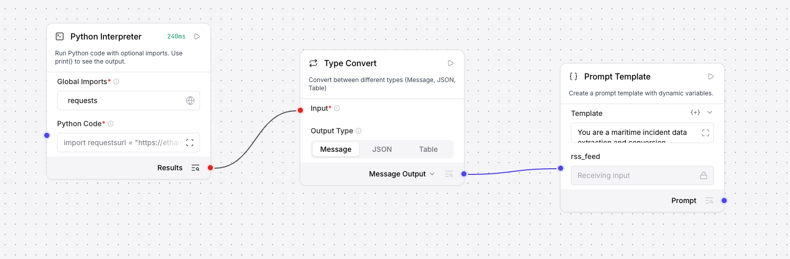

---

## 🤖 Step 5: Configure the Language Model Block

1. Search for "language model" in the block search bar
2. Drag and drop the Language Model block onto the screen after the Prompt Template block

Use the prompt template output as the language model input.


### Language Model settings

1. Under **Language Model**, select **Setup Provider**
2. Select **IBM WatsonX**
3. In the **API Key** field, input the API Key you created earlier
4. In the **Project ID** field, input: `d217e6b9-c3f8-4db6-a67d-05da7ee22435`
5. Select the **us-south.ml.cloud.ibm.com** endpoint URL
6. Click **Save**

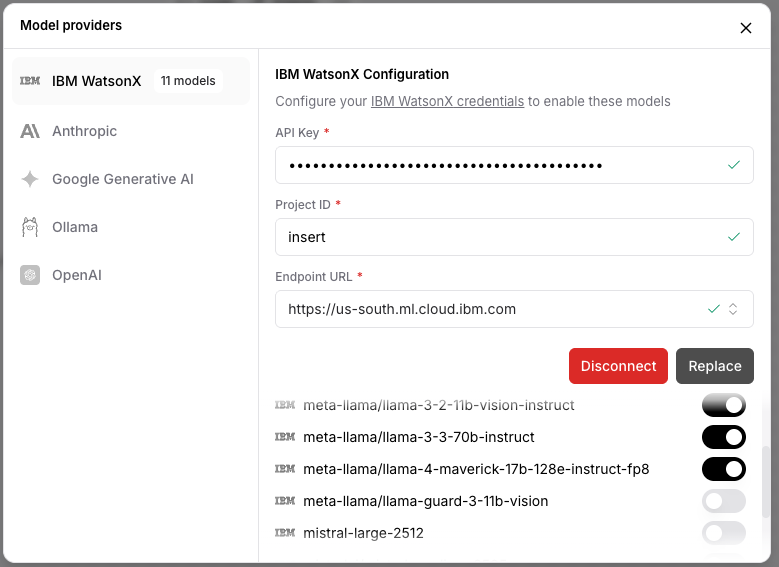

7. Make sure the toggle for the **meta-llama/llama-4-maverick-17b-128e-instruct-fp8** model is turned on

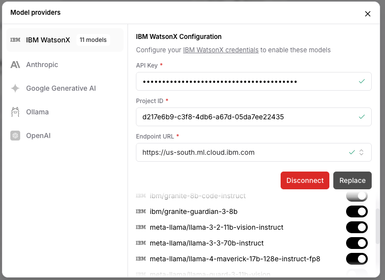

8. In the top right hand corner, in the Language Model box, Set the **Max Tokens** to `8192`
9. In the Language Model box in the canvas, change the **Language Model** to `meta-llama/llama-4-maverick-17b-128e-instruct-fp8`

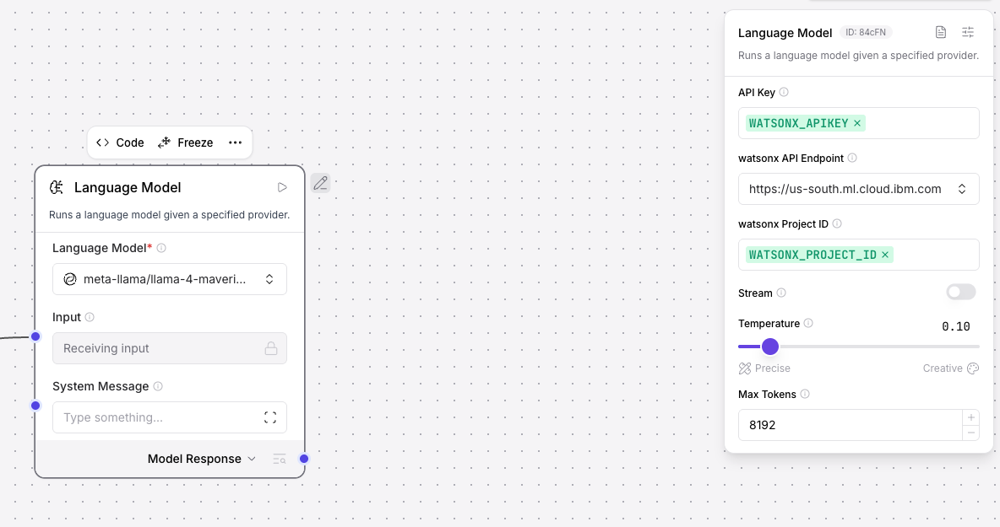

10. Configure the following settings:
   - **System Message:**

```text
Your role is to analyse RSS feed notifications and extract structured maritime incident information.
```

### Why this configuration works

- The model receives the fully rendered prompt plus RSS content
- The system message reinforces the extraction role

---

## 💬 Step 6: Connect Chat Output

1. Search for "chat output" in the block search bar
2. Drag and drop the Chat Output block onto the canvas after the Language Model block

Connect the `Response` output from **Language Model** to **Chat Output**.
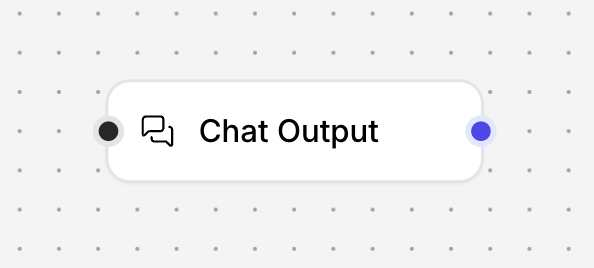


This lets you test the flow directly inside Langflow and inspect the returned JSON.

---

## 🧪 Step 7: Test the Full Flow


Run the flow and verify the following:

- The Python block successfully fetches the RSS feed
- The Type Convert block passes a message downstream
- The Prompt Template receives the `rss_feed` variable correctly
- The Language Model returns valid JSON
- The Chat Output displays extracted incident data

To run, click the playground button:

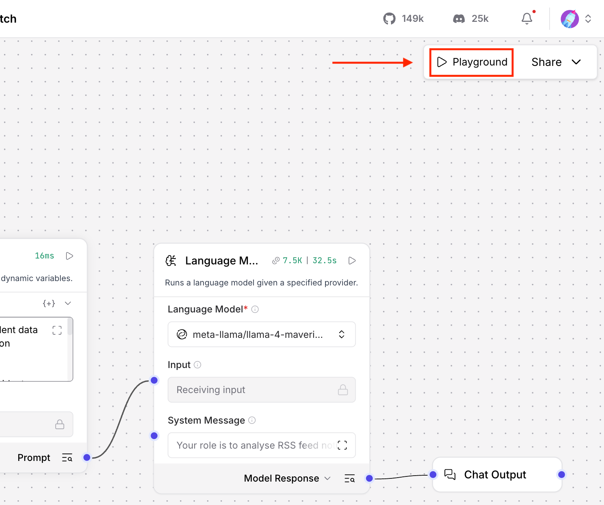

Then press run flow:

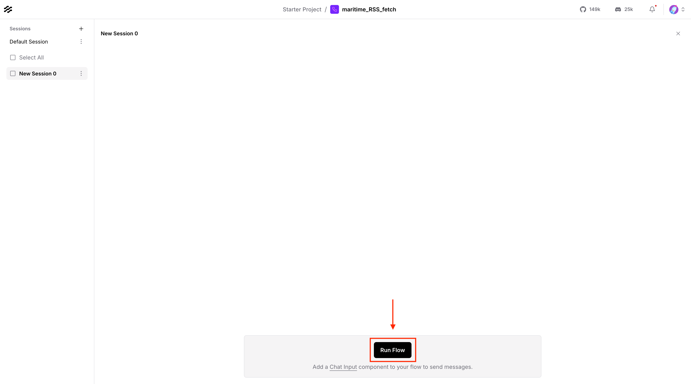

Example output:

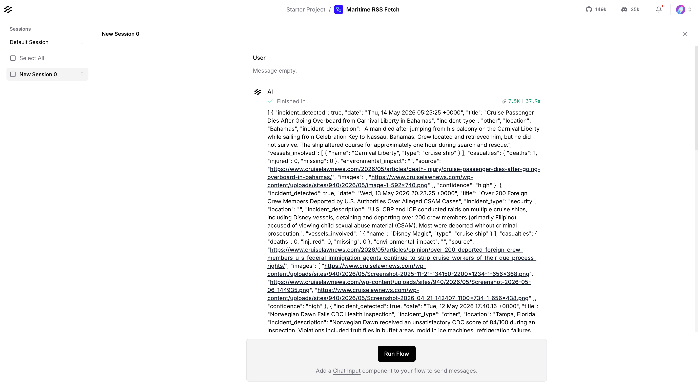

---

## 🔗 Step 8: Connect Langflow to watsonx Orchestrate

Now that your Langflow workflow is working, let's make it available as a tool in watsonx Orchestrate.

### 8.1: Share as MCP Server

1. In Langflow, click the **Share** button in the top right
2. Select **MCP Server** from the sharing options


3. Copy the MCP server URL - it should look like:
   ```
   https://langflow.example.codeengine.appdomain.cloud/api/v1/mcp/project/YOUR-PROJECT-ID/streamable
   ```


### 8.2: Create Agent via wxO ADK and Add MCP Server

#### 8.2.0: Verify Your Orchestrate Environment

Before creating the agent, ensure your watsonx Orchestrate environment is active.

1. **Check your active environment:**
   ```bash
   orchestrate env list
   ```

2. **Look for your environment in the output:**
   - If you followed Chapter 2, you should see an environment named `workshop` (or whatever name you chose)
   - The active environment will be marked with an asterisk (*)

3. **If your environment is not active, activate it:**
   ```bash
   orchestrate env activate workshop
   ```
   
   **Success message:**
   ```
   [INFO] - Environment 'workshop' is now active
   ```

4. **If you don't see any environment listed:**
   - You need to create one first
   - Refer back to **Chapter 2, Step 4 (items 7-9)** for detailed instructions on creating an environment
   - Use the command:
     ```bash
     orchestrate env add --name workshop -u https://api.watsonx-orchestrate.ibm.com/v1 --type ibm_iam --activate
     ```
   - Replace `workshop` with your preferred environment name if desired

#### 8.2.1: Create a New Agent using Bob

1. Open Bob (your AI assistant) and switch to Code mode if not already in it
2. Ask Bob to create a new agent using the wxO ADK with the following prompt:

```text
Using the wxO ADK, create a new agent called "Maritime RSS Intelligence Agent" with the following specifications:
- Description: "An AI agent that fetches and analyses maritime news from RSS feeds"
- Instructions: "You are a maritime intelligence analyst. Your role is to fetch the latest maritime news from RSS feeds, analyse incidents, and provide structured summaries with key insights about maritime security, safety, and operational events. When tools are available, use them to gather information."
- Model: Use the default model
```

3. Bob will create the agent using the ADK. Wait for confirmation that the agent has been created successfully.
#### 8.2.2: Push Agent to wxO via ADK CLI

After Bob creates the agent locally, you need to import it to watsonx Orchestrate using the ADK CLI:

1. **Verify Bob created the agent YAML file:**
   
   Bob should have created a file named `maritime_rss_intelligence_agent.yaml` (or similar) in your workspace directory.
   
   List your files to confirm:
   ```bash
   ls *.yaml
   ```

2. **Import the agent using the ADK CLI:**
   
   ```bash
   orchestrate agents import -f maritime_rss_intelligence_agent.yaml
   ```
   
   **Command flags explained:**
   - `-f` or `--file`: Path to the agent configuration YAML file
   
   **Success message:**
   ```
   Agent 'maritime_rss_intelligence_agent' imported successfully
   ```
   
   Or if updating an existing agent:
   ```
   Existing Agent 'maritime_rss_intelligence_agent' found. Updating...
   [INFO] - Agent 'maritime_rss_intelligence_agent' updated successfully
   ```

3. **Verify the agent was imported:**
   
   ```bash
   orchestrate agents list | grep maritime_rss_intelligence_agent
   ```
   
   You should see your agent listed with its details.


#### 8.2.2: Add MCP Server Tool via wxO UI

Now that Bob has created the agent, let's add the Langflow MCP server as a tool through the watsonx Orchestrate UI:

1. Go back to your watsonx Orchestrate main page, click on the top left hamburger menu '☰', then click on 'Build'


2. Select the "Maritime RSS Intelligence Agent" you just created with Bob

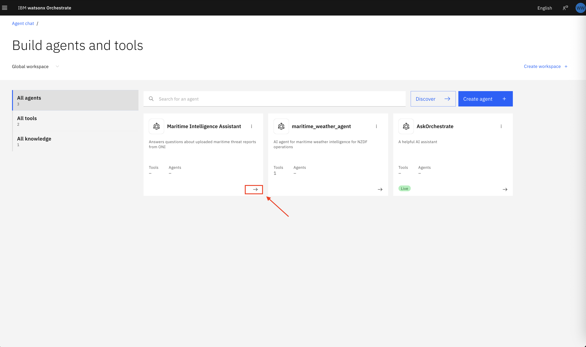

3. Scroll down to Toolset section and click on 'Add tool'

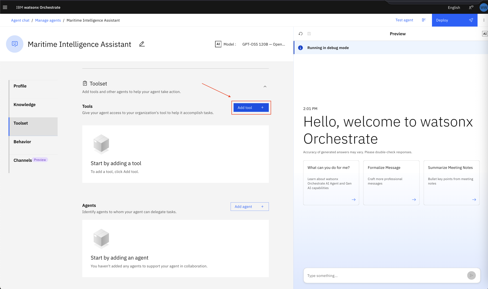

4. Select 'MCP Server'

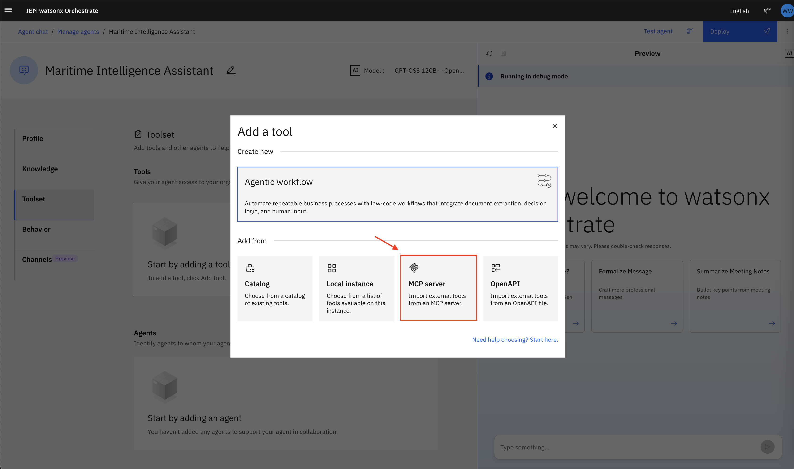

5. Click on 'Add MCP Server'


6. Select "Remote MCP server" then click on 'Next'

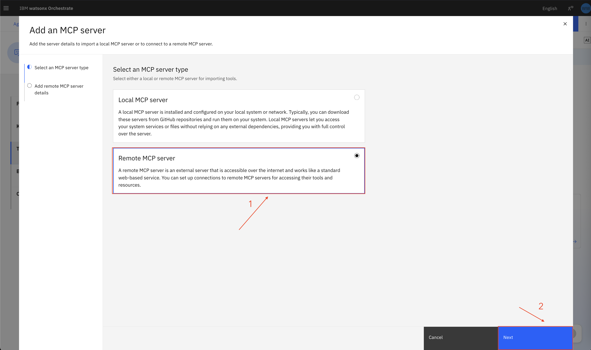

7.
- Provide a unique name `Maritime_RSS_Fetch_MCP`
- Description (Optional) `A MCP Server for fetching news from maritime RSS feeds.`
- Provide MCP server URL you generated from Step 8.1, an example is: `https://langflow.29uxiijrzw1g.us-south.codeengine.appdomain.cloud/api/v1/mcp/project/4e43d1b2-0e50-4f58-a504-8fd18d9e6b52/streamable`

Leave everything else as default and then click on 'Connect'

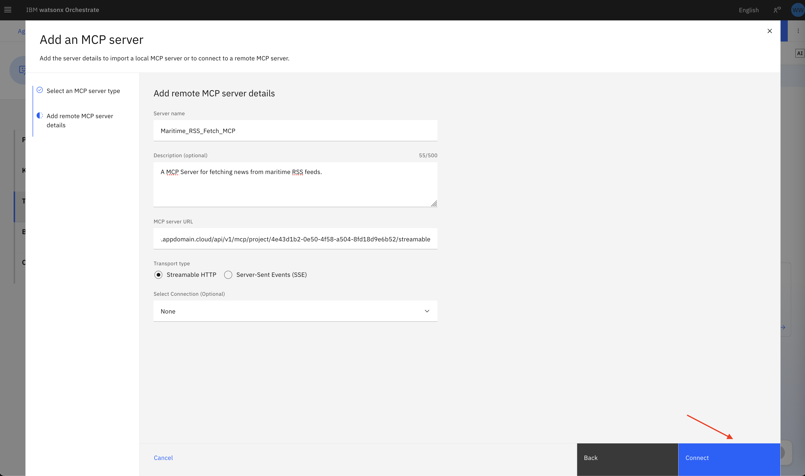

8. Select the Langflow flow that you have built then click on 'Add to Agent'

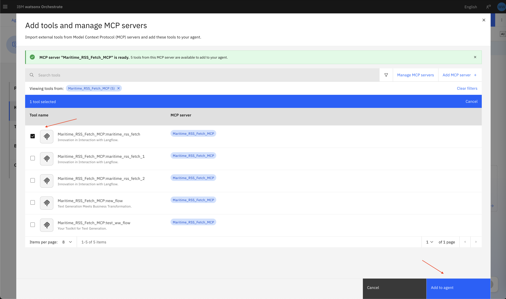

9. Now on the top right of the page you should see a success message

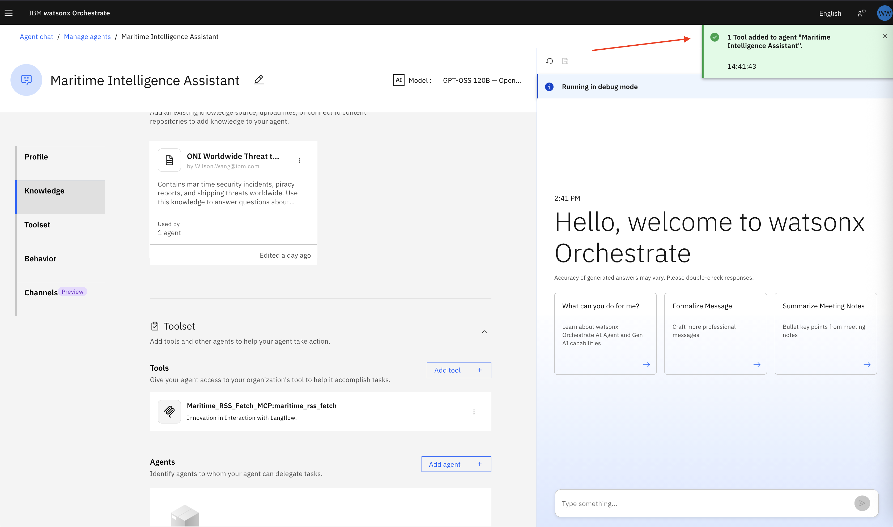


### 8.4: Test the Integration

1. Now we have successfully added our Langflow agent as a tool to Orchestrate agent, let's test it out. On the right hand side agent chat interface
2. Ask: "What are the latest maritime news updates?"
3. It can take 1-2 minutes to get an answer back depending on the number of news to be fetched and converted After some time you should be able to see the agent has responded with a table and analysis.

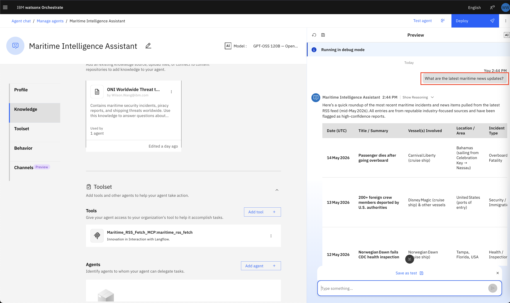

4. Click on 'Show Reasoning' to show the thought processes from the watsonx Orchestrate agent and we can see that it leveraged the MCP tool you have built. This is very useful in debugging and it shows the agent chain of thought. Click on 'Step 1' to see the input and output to the tool and click on 'show more' to see the entire output from the langflow mcp server.

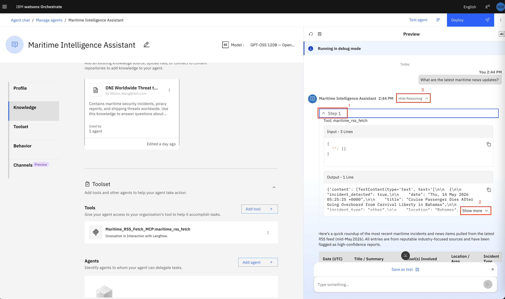

   **Troubleshooting:** If there is no reasoning shown or the agent didn't call the Maritime RSS tool to fetch the RSS feeds, you need to update the agent's behavior:
   
   a. Scroll down to the **Behaviour** section in the agent configuration
   
   b. Add this line to the end of the **Behavior Instructions**:
   ```
   IMPORTANT: You MUST use the available MCP tools to fetch real-time data. When asked about maritime news or RSS feeds, always call the Maritime RSS Fetch tool first before providing any analysis or response.
   ```
   
   c. In the top right of the chat window, click the **Reset chat** arrow
   
   d. Try asking the question again: "What are the latest maritime news updates?"

5. Scroll to the bottom of the chat to see analysis. Notice that it can be quite generic but it can be tailored to be more specific by making changes to agent's behaviour.

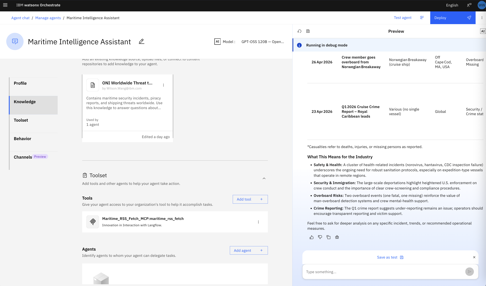

🎉 **Congratulations!** You have successfully completed the Chapter 3 hands-on activity!

---

## 🎓 Key Takeaway

This chapter shows how Langflow can turn a live RSS feed into structured maritime intelligence using a simple visual chain of blocks instead of a large custom application.

---

## 📚 Next Step

After this chapter, you can use the extracted incident JSON in:

- reporting workflows
- dashboard generation
- downstream agent tools
- maritime alerting pipelines

---

[← Back to Chapter 2](./Chapter_2_Weather_Tool_with_IBM_Bob.md) | [Back to Main Guide](../README.md) | [Next: Chapter 4 →](./Chapter_4_Master_Intelligence_Agent_and_Unified_Reporting.md)
