# Chapter 3: RSS Feed Integration with Langflow

**Time:** 2:30 PM - 3:15 PM (45 minutes)
**Goal:** Build a Langflow workflow that extracts structured maritime incidents from RSS feeds

---

## 🎯 Learning Objectives

By the end of this chapter, you will:

1. ✅ Build a working Langflow pipeline using visual blocks
2. ✅ Pull live RSS content with the Python Interpreter block
3. ✅ Convert raw Python output into a message Langflow can pass downstream
4. ✅ Use a prompt template to enforce structured maritime extraction
5. ✅ Configure a language model to return incident JSON for downstream workflows

---

## 🔗 Access Langflow

Click here to access the Langflow environment for this workshop:

**[Open Langflow](https://langflow.29hoasy3dp25.us-south.codeengine.appdomain.cloud/)**

---

## 📖 What We're Building

A Langflow workflow that reads a maritime RSS feed and transforms it into structured incident data for later use in watsonx Orchestrate, reporting, or visualisation.

### Block sequence

`Python Interpreter → Type Convert → Prompt Template → Language Model → Chat Output`

### What the workflow does

- Pulls XML content from a live maritime RSS feed
- Passes the raw feed into a prompt as input text
- Uses an LLM to extract incident details
- Returns structured JSON
- Sends the result to chat output for testing in Langflow

---

## 🖼️ Chapter 3 Reference Image

Use this screenshot as the visual reference while recreating the flow in Langflow:

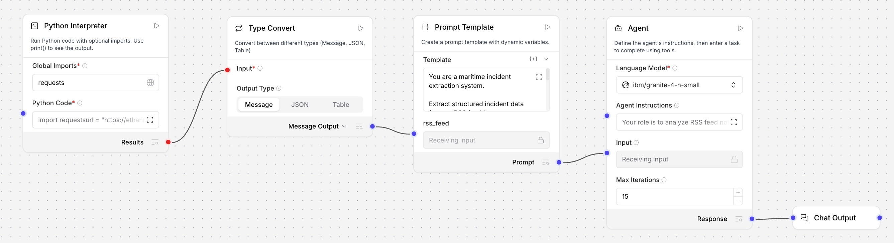

---

## 🧱 Langflow Blocks and Connections

Build the flow in this exact order:

1. **Python Interpreter**
2. **Type Convert**
3. **Prompt Template**
4. **Language Model**
5. **Chat Output**

### Connections

- Connect the `Results` output from **Python Interpreter** to the `Input` of **Type Convert**
- Connect the `Message Output` from **Type Convert** to the `rss_feed` variable input on **Prompt Template**
- Connect the `Prompt` output from **Prompt Template** to the `Input` on **Language Model**
- Connect the `Response` output from **Language Model** to **Chat Output**

This creates a linear extraction pipeline from RSS collection through to final structured output.

---

## 🚀 Step 1: Create the Langflow Flow

1. Open Langflow
2. Create a new blank flow

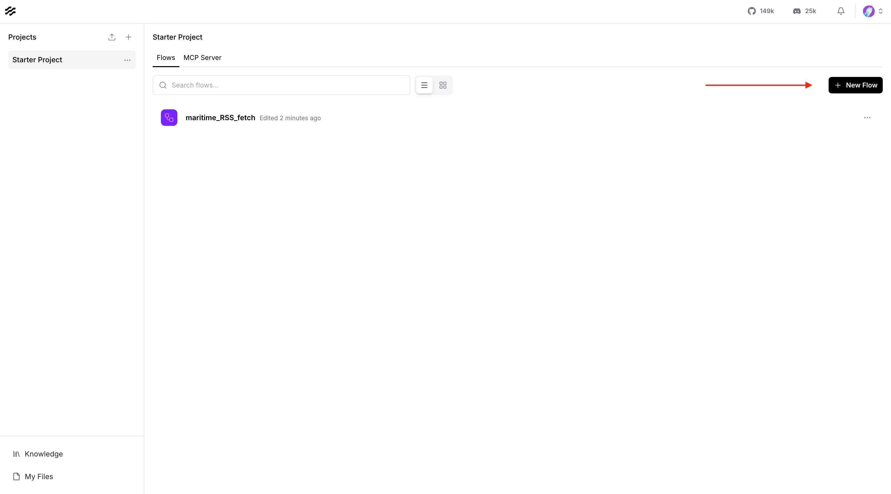

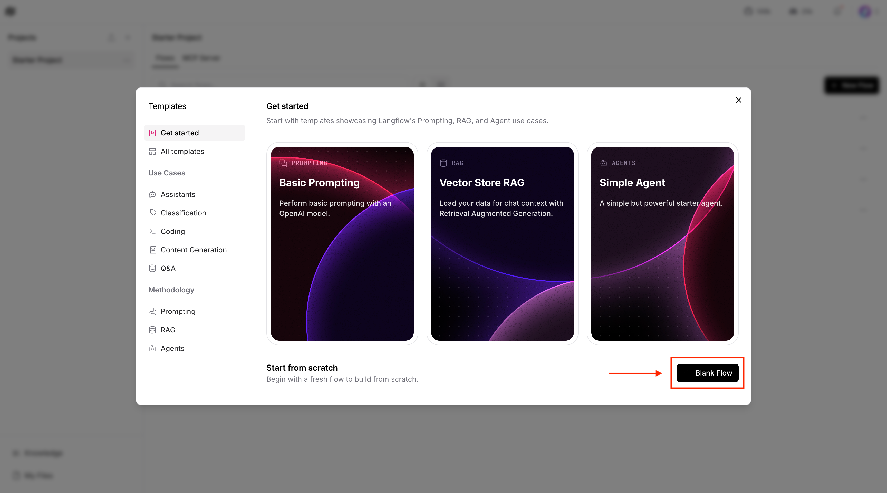

---

## 🐍 Step 2: Configure the Python Interpreter Block

1. Search for the python interpreter block.
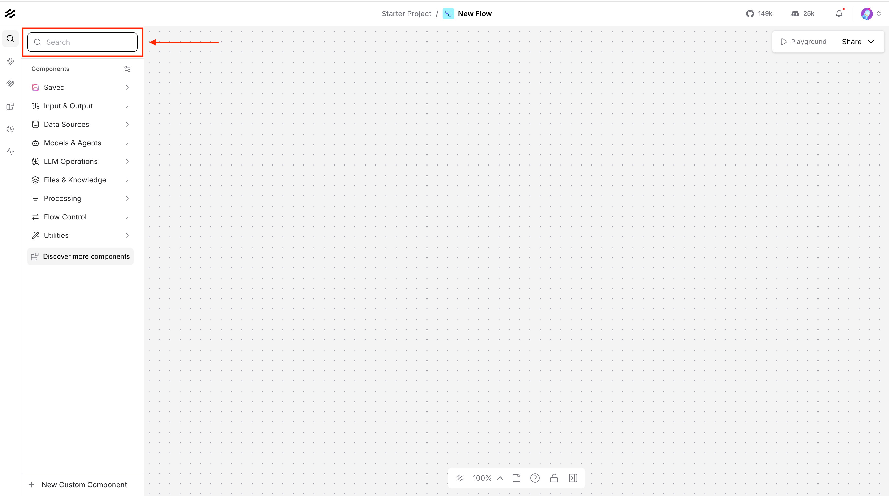
2. Drag and drop the python interpreter block onto the screen.
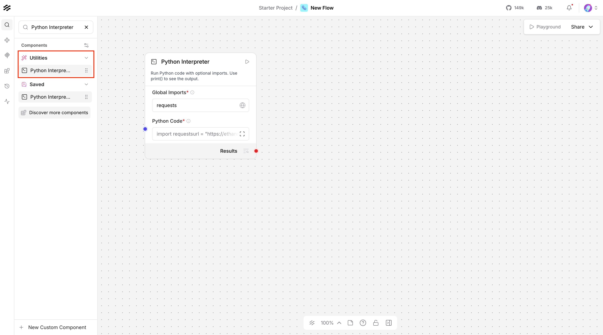
3. Add `requests` to the **Global Imports** field.
  ```text
  requests
  ```
4. Click to expand the Python Interpreter block, then paste in the Python code below:
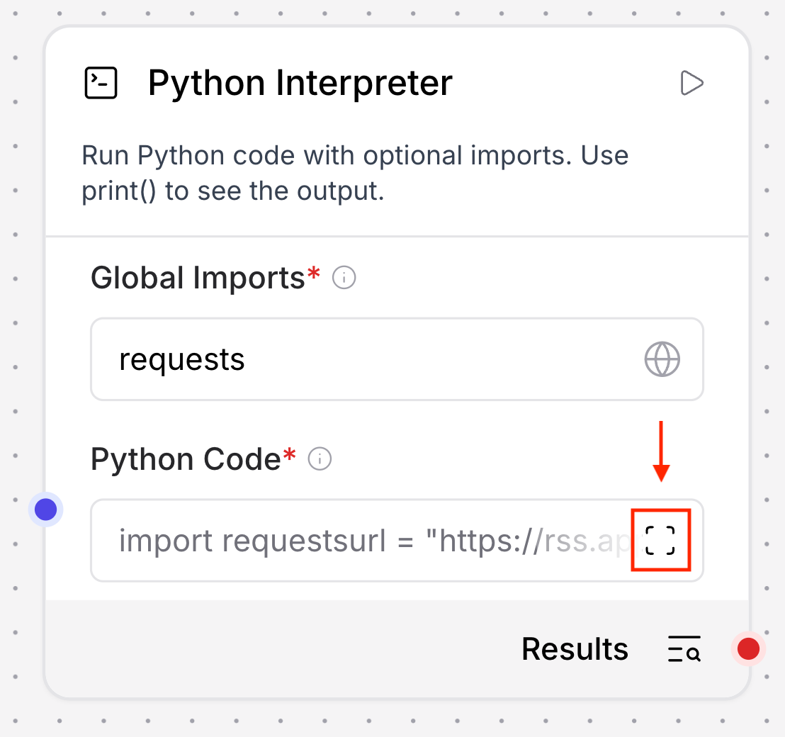

### Python Code

```python
import requests

url = "https://ethanmark7.github.io/rss_feed/rss.xml"
headers = {
    "User-Agent": (
        "Mozilla/5.0 (Windows NT 10.0; Win64; x64) "
        "AppleWebKit/537.36 (KHTML, like Gecko) "
        "Chrome/136.0 Safari/537.36"
    )
}

response = requests.get(url, headers=headers, timeout=30)
print("Status:", response.status_code)
print(response.text[:20000])
```

### What this block does

- Imports the `requests` library
- Fetches the Cruise Law News RSS feed
- Adds a browser-style user agent header
- Prints the HTTP status
- Prints up to the first 20,000 characters of the feed so the downstream blocks can process it


### Try running it

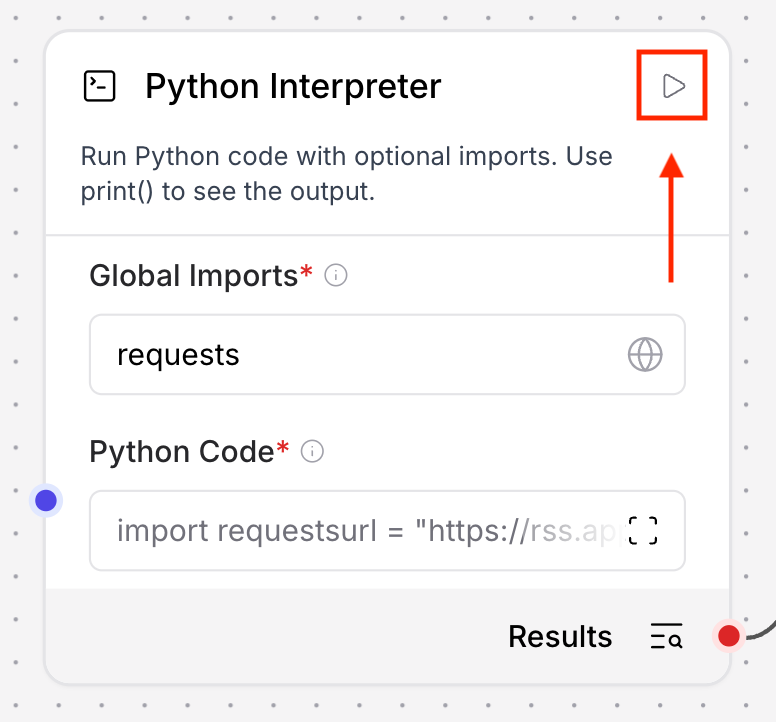

Run the workflow to see the result - you should see a successful HTTP status such as `200` and raw RSS/XML content in the output. Then click the output button to see the output.

---

## 🔁 Step 3: Configure the Type Convert Block

The Python Interpreter output needs to be converted into a message before it can be injected cleanly into the prompt workflow.

### Configuration

- **Input:** Connect from Python Interpreter `Results`
- **Output Type:** `Message`


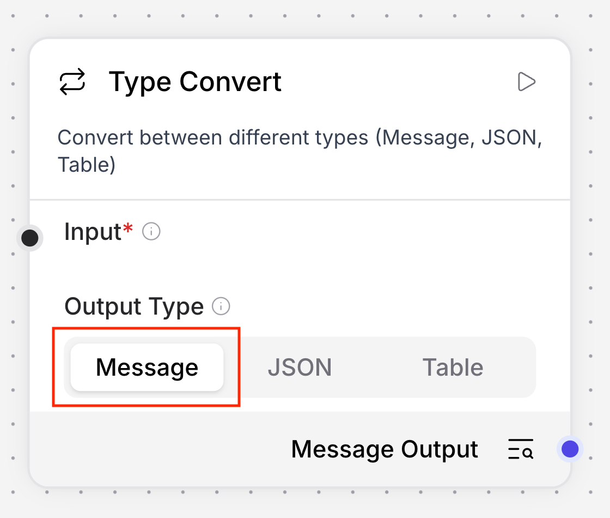

### Why this matters

This makes the Python output compatible with the variable input expected by the prompt block.

---

## 🧠 Step 4: Configure the Prompt Template Block

Create a prompt template with one dynamic variable:

- `rss_feed`


Paste the following into the template field.

```text
You are a maritime incident data extraction and conversion specialist. 

Your job is to extract incident data from an RSS XML input, classify incident_type, extract all image urls and return a JSON array object that contains all <item>.

Instructions:
- If no incident exists, return empty json array []
- Extract all images from xml tags from each item: <media:content medium="image"> and 
- Do not output anything other than a valid json array object
- Do not output your thinking process or explanation
- "incident_type" should be classified into one of the following types based on <description>: "collision", "grounding", "fire", "machinery failure", "pollution", "weather", "port disruption", "security", "other".
- "title" should be the content extracted from <title> 
- "incident_description" should be the human readable content extracted from <description>
- ignore any <item> that doesn't have <description> or has empty <description> content

Output JSON format:
[
  "incident_detected": true,
  "date": "",
  "title": "",
  "incident_type": "",
  "location": "",
  "incident_description": "",
  "vessels_involved": [
    
      "name": "",
      "type": ""
    
  ],
  "casualties": 
    "deaths": 0,
    "injured": 0,
    "missing": 0
  ,
  "environmental_impact": "",
  "source": "",
  "images": [],
  "confidence": "high | medium | low"
]

RSS input:
{rss_feed}

Output json array object only with no backticks no explanation:
```

### What this block does

- Frames the extraction task
- Constrains the output to JSON only
- Defines the expected schema
- Passes live RSS content through the `{rss_feed}` variable

---

## 🤖 Step 5: Configure the Language Model Block

Use the prompt template output as the language model input.

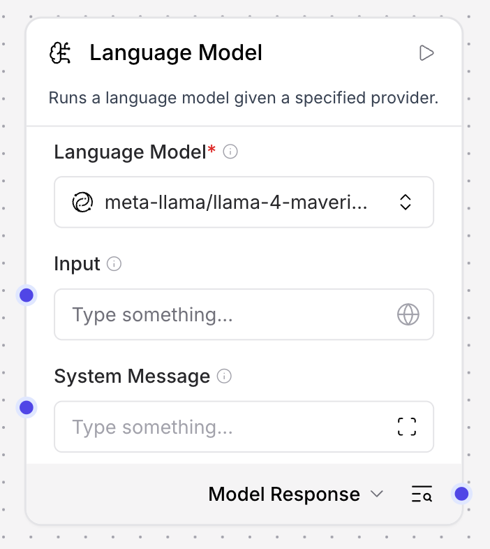

### Language Model settings

- **Model:** `meta-llama/llama-4-maverick-17b-128e-instruct-fp8`
- **System Message:**

```text
Your role is to analyse RSS feed notifications and extract structured maritime incident information.
```

### Language Model input connection

Connect the `Prompt` output from **Prompt Template** into the **Input** on **Language Model**.

### Why this configuration works

- The model receives the fully rendered prompt plus RSS content
- The system message reinforces the extraction role

---

## 💬 Step 6: Connect Chat Output

Connect the `Response` output from **Language Model** to **Chat Output**.

This lets you test the flow directly inside Langflow and inspect the returned JSON.

---

## 🧪 Step 7: Test the Full Flow

Run the flow and verify the following:

- The Python block successfully fetches the RSS feed
- The Type Convert block passes a message downstream
- The Prompt Template receives the `rss_feed` variable correctly
- The Language Model returns valid JSON
- The Chat Output displays extracted incident data

---

## 🔗 Step 8: Connect Langflow to watsonx Orchestrate

Now that your Langflow workflow is working, let's make it available as a tool in watsonx Orchestrate.

### 8.1: Share as MCP Server

1. In Langflow, click the **Share** button in the top right
2. Select **MCP Server** from the sharing options

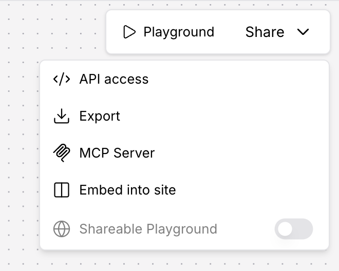

3. Copy the MCP server URL - it should look like:
   ```
   https://langflow.example.codeengine.appdomain.cloud/api/v1/mcp/project/YOUR-PROJECT-ID/streamable
   ```

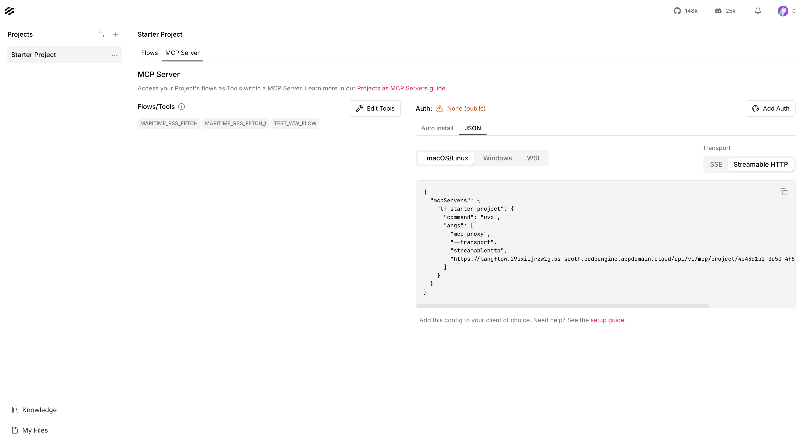

### 8.2: Add MCP Server to Orchestrate

1. Go back to your watsonx Orchestrate project
2. Navigate to **Tools** section
3. Click **Create Tool**

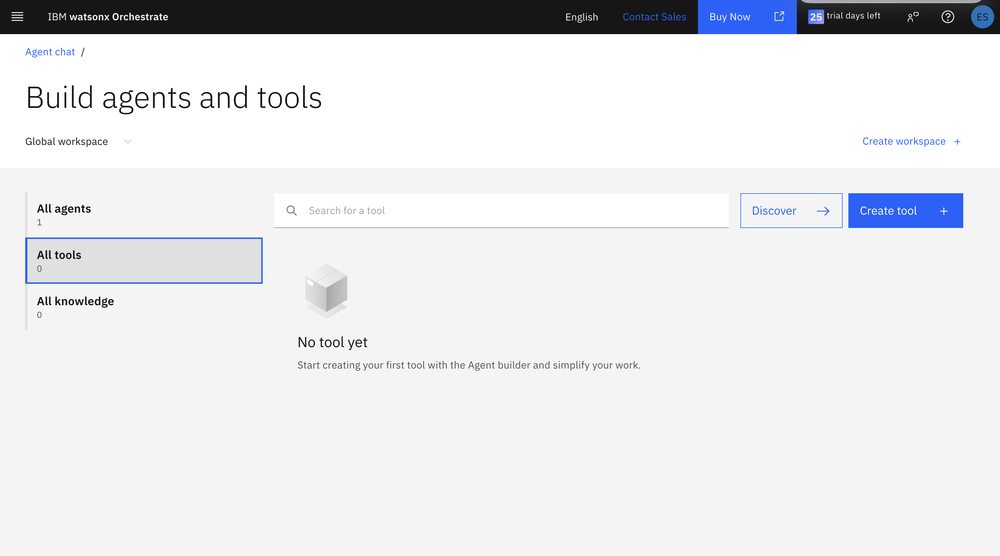

4. Select **Add from MCP server**
5. Click **Add MCP server**
6. Choose **Remote MCP server**

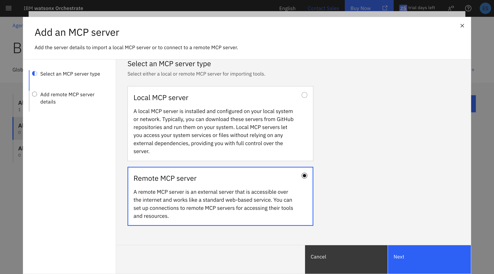

7. Give your server a name (e.g., "Maritime RSS Feed Extractor")
8. Paste in the MCP server URL you copied from Langflow
9. Click **Connect**

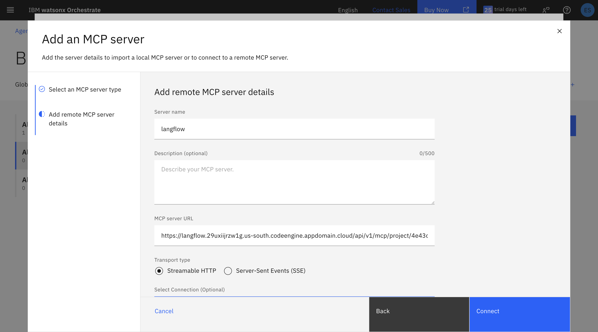

10. Click **Done** to add the tool to your project

### 8.3: Create or Update an Agent

1. Go to **Agents** in your Orchestrate project
2. Either create a new agent or open an existing one

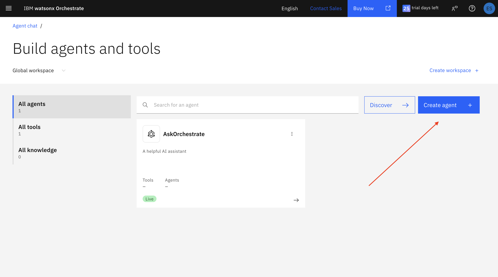

3. Click **Manage Agents** if editing an existing agent

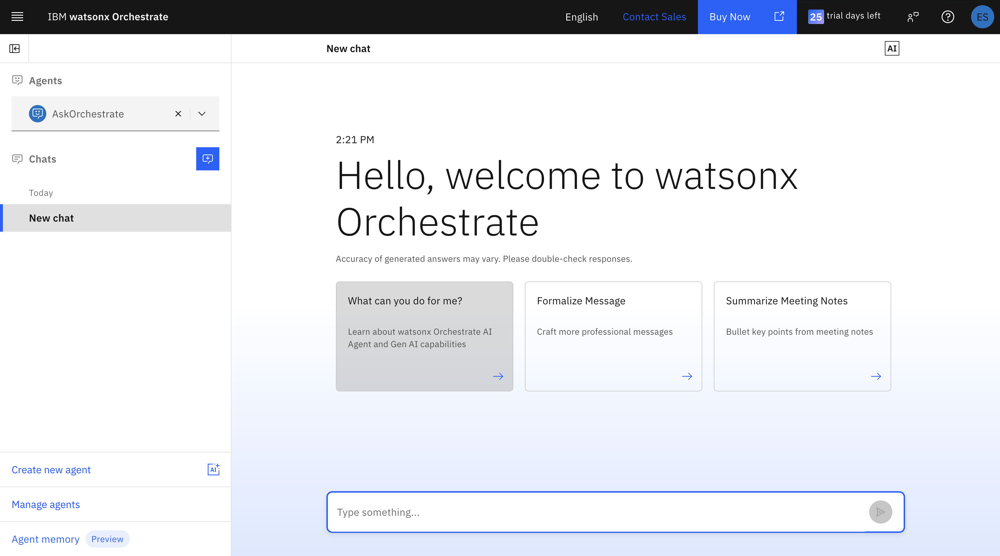

4. Add the RSS feed tool you just created to your agent's available tools

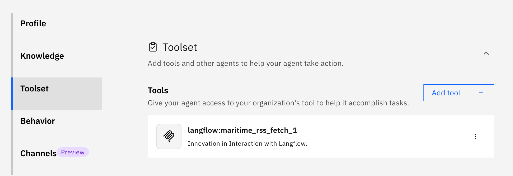

5. Save the agent configuration

### 8.4: Test the Integration

1. Open the agent chat interface
2. Ask: "What are the latest maritime news updates?"
3. The agent should use your Langflow tool to fetch and extract RSS feed data
4. Verify the agent returns structured maritime incident information

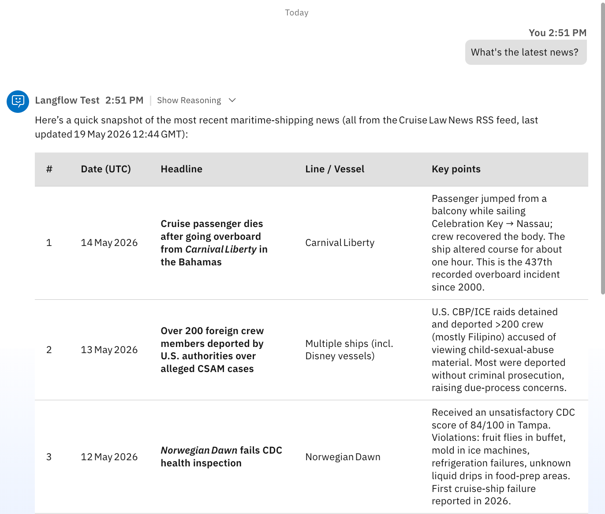

---

## 🎓 Key Takeaway

This chapter shows how Langflow can turn a live RSS feed into structured maritime intelligence using a simple visual chain of blocks instead of a large custom application.

---

## 📚 Next Step

After this chapter, you can use the extracted incident JSON in:

- reporting workflows
- dashboard generation
- downstream agent tools
- maritime alerting pipelines

---

[← Back to Chapter 2](./Chapter_2_Document_Analysis_Agent.md) | [Back to Main Guide](../README.md) | [Next: Chapter 4 →](./Chapter_4_Visualisation_with_Bob.md)