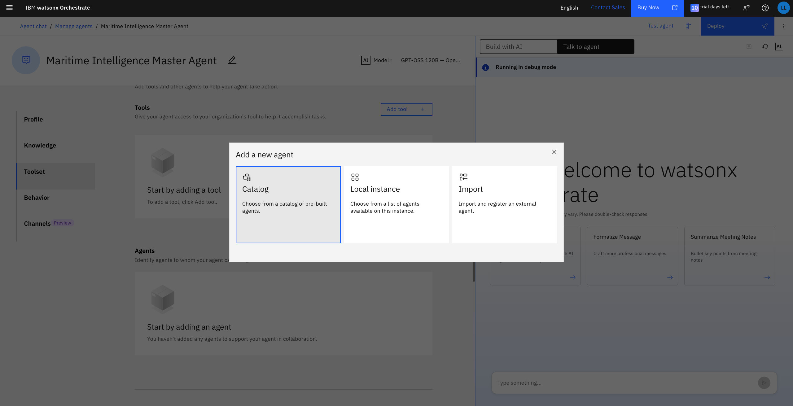
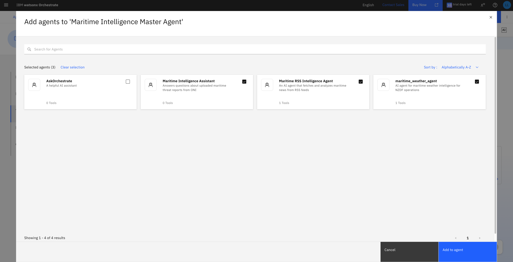
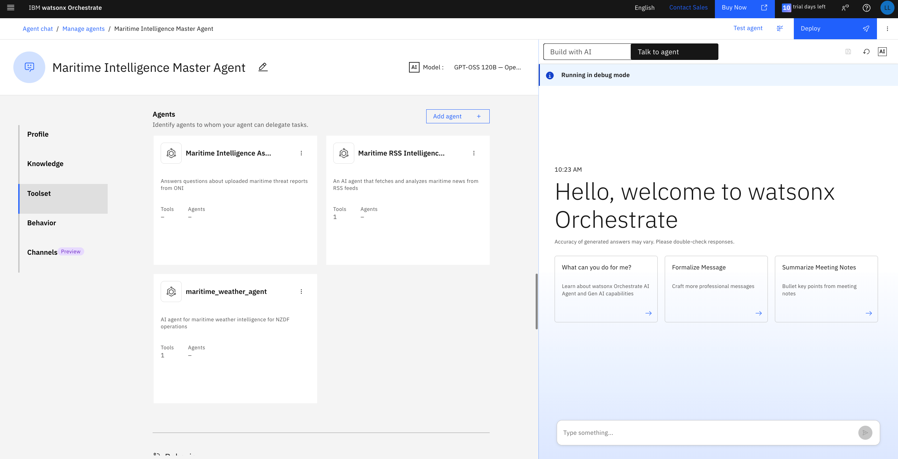
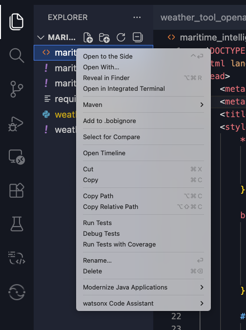

# Chapter 4: Master Intelligence Agent & Unified Reporting

**Time:** 3:15 PM - 3:30 PM (15 minutes)
**Goal:** Create a master orchestration agent that brings all your agents together

---

## 🎯 Learning Objectives

By the end of this chapter, you will:

1. ✅ Create a master agent in watsonx Orchestrate
2. ✅ Connect all previously built agents as sub-agents
3. ✅ Design a unified intelligence report structure
4. ✅ Generate comprehensive maritime intelligence briefings
5. ✅ Experience agent orchestration and composition

---

## 📖 What We're Building

A **Master Maritime Intelligence Agent** that:
- Orchestrates all your specialised agents (Document Q&A, Weather, RSS News)
- Collects intelligence from multiple sources simultaneously
- Synthesizes information into a unified report
- Generates executive-ready briefings
- Provides comprehensive situational awareness

**Think of it as your Intelligence Operations Center in a single agent!**

---

## 🏗️ Architecture Overview

```
┌─────────────────────────────────────────┐
│   Master Maritime Intelligence Agent    │
│         (Orchestrator)                   │
└──────────────┬──────────────────────────┘
               │
       ┌───────┴───────┬──────────────┐
       │               │              │
       ▼               ▼              ▼
┌──────────────┐  ┌──────────────┐  ┌──────────────┐
│Maritime      │  │maritime_     │  │Maritime RSS  │
│Intelligence  │  │weather_agent │  │Intelligence  │
│Assistant     │  │              │  │Agent         │
└──────────────┘  └──────────────┘  └──────────────┘
```

---

## 🚀 Step-by-Step Guide

### Step 1: Create the Master Agent (3 minutes)

#### 1.1 Navigate to watsonx Orchestrate

1. Open your **watsonx Orchestrate** instance
2. Click on **"Build"** in the left navigation menu
3. Click **"Create an agent"** button
4. Click **"Create from scratch"**

#### 1.2 Configure Master Agent

1. **Name:** `Maritime Intelligence Master Agent`
2. **Description:** 
   ```
   Master orchestration agent that coordinates multiple intelligence sources 
   to generate comprehensive maritime situational awareness reports.
   ```
3. Click **"Create from scratch"**

#### 1.3 Set Agent Instructions

In the **Instructions** field, paste:

```
You are the Master Maritime Intelligence Coordinator for naval operations.

Your role is to:
1. Coordinate multiple intelligence sources simultaneously
2. Gather information from document analysis, weather forecasts, and news monitoring
3. Synthesise all intelligence into a comprehensive briefing
4. Present findings in a clear, actionable format for decision-makers

When generating reports, always include:
- Executive Summary (key findings in 3-5 bullet points)
- Threat Assessment (from document analysis)
- Environmental Conditions (from weather agent)
- Current Events & News (from RSS monitoring)
- Recommendations (actionable intelligence)
- Confidence Levels (for each intelligence source)

Format all reports professionally with clear sections and prioritise
critical information for rapid decision-making.
```

4. Click **"Save"** in the top right

---

### Step 2: Connect Your Sub-Agents (5 minutes)

#### 2.1 Add Document Q&A Agent

1. In your Master Agent, scroll to the **"Tools"** section
2. Under **"Agents"**, select **"Add agent"**
3. Select **"Local instance"**



4. Select **"Agent"** from the tool types
5. Select all the agents you created earlier



6. Click **"Add to agent"**



**What this enables:** Your master agent will now have access to all of the agents and tools you've created earlier

---

### Step 3: Generate Your First Unified Report (5 minutes)

#### 4.1 Test the Master Agent

1. In the Master Agent chat interface, enter:

```
Generate a comprehensive Maritime Intelligence Briefing for the Indian Ocean region focusing on the Gulf of Aden and Horn of Africa area.
```

2. Click **"Send"** or press Enter

#### 4.2 Observe Agent Orchestration

Watch as the Master Agent:
1. **Plans** its approach (you'll see reasoning if enabled)
2. **Calls** the Document Q&A Agent for threat intelligence
3. **Calls** the Weather Agent for environmental conditions
4. **Calls** the RSS News Agent for current events
5. **Synthesises** all information into a unified report

#### 4.3 Review the Generated Report

The Master Agent should produce a structured report with:
- ✅ Executive summary with key findings
- ✅ Threat assessment from historical documents
- ✅ Weather forecast and operational impact
- ✅ Latest news and incidents
- ✅ Synthesised recommendations

#### 4.4 Enable "Show Reasoning" (Optional)

To see how the agent orchestrates sub-agents:
1. Click the **"Show reasoning"** toggle in the chat interface
2. Observe the agent's decision-making process:
   - Which sub-agents it calls
   - What questions it asks each agent
   - How it synthesises responses

---

## 🎓 Key Takeaways

### The Power of Agent Orchestration

**What You've Achieved:**
- Created a **master orchestration layer** over specialised agents
- Enabled **multi-source intelligence fusion** automatically
- Built a **scalable architecture** (easy to add more agents)
- Demonstrated **agent composition** patterns

**Traditional Approach:**
- Manual data collection from multiple systems: 2 hours
- Copy/paste information into report template: 1 hour
- Cross-reference and synthesise: 2 hours
- Format and review: 1 hour
- **Total: 6 hours per report**

**With Master Agent:**
- Single prompt to generate comprehensive report: 2 minutes
- Review and customise: 3 minutes
- **Total: 5 minutes per report**

**Result: 72x faster intelligence reporting!**

---

## 💡 Best Practices for Master Agents

### Orchestration Tips

1. **Clear Instructions:** Give the master agent explicit coordination instructions
2. **Structured Prompts:** Use consistent report templates for reliable output
3. **Sub-Agent Naming:** Use descriptive names so the master agent knows when to call each
4. **Error Handling:** Master agent should gracefully handle if a sub-agent is unavailable
5. **Confidence Levels:** Always include confidence/reliability indicators

### Report Design Principles

1. **Executive Summary First:** Decision-makers need key findings immediately
2. **Source Attribution:** Always indicate which agent provided which intelligence
3. **Actionable Intelligence:** Focus on what can be done with the information
4. **Time Sensitivity:** Highlight time-critical information prominently
5. **Consistent Format:** Use the same structure for easy comparison over time

---

## 🔧 Troubleshooting

### Common Issues

**Issue:** Master agent doesn't call sub-agents
- **Solution:** Ensure sub-agents are properly added as tools
- **Solution:** Make your prompt more explicit about querying each source

**Issue:** Report is incomplete or missing sections
- **Solution:** Refine the master agent's instructions to be more specific
- **Solution:** Use a more structured prompt template

**Issue:** Sub-agent responses are not synthesised well
- **Solution:** Add explicit synthesis instructions to the master agent
- **Solution:** Ask the master agent to "correlate findings across sources"

**Issue:** Report takes too long to generate
- **Solution:** Sub-agents may be timing out; check their individual performance
- **Solution:** Consider making sub-agent queries more focused

---

## 📊 Success Criteria

You've successfully completed Chapter 4 if:

- ✅ Master agent created and configured
- ✅ All three sub-agents connected as tools
- ✅ Generated a comprehensive intelligence report
- ✅ Report includes data from all sources
- ✅ Information is properly synthesised
- ✅ Report is executive-ready and actionable

---

## 🎨 Customization Ideas

### Enhance Your Master Agent

**Add More Intelligence Sources:**
- Satellite imagery analysis agent
- Vessel tracking agent (AIS data)
- Social media monitoring agent
- Cyber threat intelligence agent

**Create Specialised Report Types:**
- Daily intelligence brief (quick summary)
- Weekly intelligence assessment (trends)
- Incident-specific deep dive
- Regional threat analysis
- Operational planning brief

**Add Automation:**
- Schedule automatic report generation
- Set up alerts for high-priority findings
- Create distribution lists for different report types
- Archive reports for historical analysis

**Improve Synthesis:**
- Add correlation rules for pattern detection
- Include confidence scoring algorithms
- Create threat level escalation logic
- Add predictive analytics

---

## 🎯 Workshop Progress Check

**What You've Built:**

✅ **Chapter 1:** Maritime Document Q&A Agent (Knowledge base)  
✅ **Chapter 2:** Weather Intelligence Agent (Real-time data)  
✅ **Chapter 3:** RSS News Monitoring Agent (Current events)  
✅ **Chapter 4:** Master Intelligence Agent (Orchestration & Reporting)

**Result:** Complete end-to-end maritime intelligence system with automated reporting!

---

## 🚀 Real-World Applications

### How This Scales to Production

**Current Workshop Setup:**
- 3 specialised agents
- 1 master orchestrator
- Manual report generation

**Production Deployment Could Include:**
- 10+ specialised intelligence agents
- Multiple master agents for different regions
- Automated scheduled reporting
- Integration with command & control systems
- Real-time alerting and notifications
- Historical trend analysis
- Predictive threat modeling

**The architecture you built today is production-ready and scalable!**

---

## 📚 Additional Resources

### Agent Orchestration Patterns
- Multi-agent systems design
- Agent communication protocols
- Hierarchical agent architectures
- Agent coordination strategies

### Intelligence Reporting
- Intelligence cycle methodology
- Report writing best practices
- Executive briefing techniques
- Confidence level frameworks

### watsonx Orchestrate
- Advanced agent configuration
- Tool integration patterns
- Performance optimisation
- Security and access control

---

## 🎓 What You've Learned

### Technical Skills
- Agent orchestration and composition
- Multi-source data integration
- Automated report generation
- Prompt engineering for coordination

### Intelligence Concepts
- Intelligence fusion methodology
- Multi-source correlation
- Confidence assessment
- Executive briefing structure

### AI/Agentic Patterns
- Master-worker agent pattern
- Tool-calling and delegation
- Synthesis and summarisation
- Structured output generation

---

## 🌍 Optional: Interactive Globe Visualisation (Bonus Section)

**Time:** 5-10 minutes (Optional)
**Goal:** Create an interactive 3D globe visualisation of your maritime intelligence report

### Why Visualise?

Intelligence reports are powerful, but **visual representations** can:
- Provide instant situational awareness at a glance
- Show geographic relationships between threats, weather, and naval assets
- Enable interactive exploration of maritime zones
- Enhance executive briefings with compelling visuals
- Support operational planning with spatial context

### What We'll Create

An **interactive 3D globe** that displays:
- 🎯 Incident locations (piracy attacks, interdictions, rescues)
- 🌊 Weather conditions and sea states
- ⚓ Naval asset positions
- 📍 Key maritime chokepoints (Bab al-Mandeb, Gulf of Aden)
- 🔴 Threat zones with colour-coded risk levels

---

### Step 1: Copy Your Report from Orchestrate

1. In your **Master Maritime Intelligence Agent** chat, locate the comprehensive report you generated
2. **Scroll to the bottom** of the report and click the **copy button**
3. Keep this ready for Bob

---

### Step 2: Ask Bob to Create the Visualization

#### 2.1 Open Bob and Start a New Task

#### 2.2 Provide the Report to Bob

In Bob's chat interface, paste the following prompt (replace `[YOUR REPORT]` with your actual report):

```
I have a maritime intelligence report that I'd like to visualise on an interactive 3D globe.

Please create a SINGLE, SELF-CONTAINED HTML file with an interactive globe visualisation.

REQUIREMENTS:
1. Use Globe.gl library (https://globe.gl/) - it's reliable and well-documented
2. Extract ALL incident locations from the report with their coordinates
3. Create distinct visual markers for each incident type:
   - Piracy attacks (red, pulsing)
   - Armed robbery (orange)
   - Interdictions (yellow)
   - Rescues (green)
   - Naval assets (blue)
   - Missile threats (magenta)
   - Training exercises (purple)
4. Add information panels showing:
   - Threat assessment summary
   - Weather conditions
   - Legend with all marker types
5. Include interactive controls:
   - Pause/resume rotation
   - Quick zoom to key areas (Gulf of Aden, Somalia Coast, Bab al-Mandeb)
   - Reset view button
6. Use a dark theme suitable for operations centres
7. Add tooltips that appear on hover with incident details

TECHNICAL SPECIFICATIONS:
- All JavaScript libraries must be loaded from CDN (unpkg.com or cdnjs)
- Use Globe.gl version 2.31.0 or later
- Ensure all coordinates are in decimal degrees format (latitude, longitude)
- Test that the globe loads properly with the earth texture
- Make sure auto-rotation works smoothly
- Verify all event handlers are properly bound

STYLING:
- Dark background (#0a0e27)
- Cyan accents (#00d4ff) for headers and borders
- Semi-transparent panels with backdrop blur
- Smooth animations and transitions
- Professional, military-grade aesthetic

Here's the maritime intelligence report to visualise:

[YOUR REPORT]

Please ensure the HTML file is complete, tested, and ready to open directly in a browser.
Include console.log statements to help debug if needed.
```

#### 2.3 Let Bob Work His Magic

Bob will:
1. **Analyse** your maritime intelligence report
2. **Extract** all geographic locations, incidents, and data points
3. **Design** an appropriate visualisation architecture
4. **Generate** a complete HTML file with embedded JavaScript
5. **Create** an interactive 3D globe with all your intelligence data

**This typically takes 2-3 minutes.**

---

### Step 3: View Your Visualisation

#### 3.1 Locate the Generated File

Bob will create a file (typically named something like `maritime_intelligence_globe.html`) in your workspace directory.

#### 3.2 Open in Browser

**Option 1: Direct Open**
1. Locate the HTML file in the file explorer
2. Right-click the file
3. Select **"Reveal in Finder/Explorer"**



4. Double-click the file to open in your default browser

**Option 2: Use Bob's Preview**
1. Ask Bob: "Can you open this visualisation in a browser preview?"
2. Bob may provide a local server command or preview option

#### 3.3 Interact with Your Globe

Once opened, you can:
- **Rotate** the globe by clicking and dragging
- **Zoom** in/out using mouse wheel or pinch gestures
- **Click markers** to see incident details
- **Hover** over regions to see threat levels
- **Pan** to explore different areas

---

### Step 4: Customise Your Visualisation (Optional)

#### 4.1 Adjust Visual Elements

Ask Bob to modify the visualisation:

```
Can you update the globe to:
- Make piracy incidents show as red pulsing markers
- Add a legend showing what each colour/icon means
- Include a timeline slider to show incidents over time
- Add naval patrol routes as animated lines
- Make the weather overlay semi-transparent
```

#### 4.2 Add More Data Layers

```
Please add these additional layers to the globe:
- Shipping lanes (major commercial routes)
- Exclusive Economic Zones (EEZ boundaries)
- Historical incident heatmap
- Real-time vessel tracking (if AIS data available)
```

#### 4.3 Export Options

```
Can you add export functionality to:
- Save the current view as a PNG image
- Generate a PDF report with the visualisation
- Export data as GeoJSON for GIS systems
```

---

### Example Visualisation Features

Based on your sample report, Bob might create:

**Incident Markers:**
- 🔴 **Red pulsing marker** - MV Al-Mansur piracy attack (70 nm SE of Aden)
- 🟡 **Yellow marker** - MV Seylan interdiction (120 nm W of Djibouti)
- 🔵 **Blue marker** - Somali fishermen rescue (40 nm SW of Berbera)
- ⚫ **Black marker** - Platform blast (15 nm NW of Bab al-Mandeb)

**Weather Overlay:**
- 🌩️ **Dark clouds** over Gulf of Aden showing severe thunderstorm regime
- 🌊 **Wave animation** showing rough sea state (Beaufort 6-7)
- 💨 **Wind vectors** showing E-SE direction

**Naval Assets:**
- 🚢 **Green ship icons** - HMS Dartmouth, JS Murasame, INS Kolkata positions
- ⚓ **Patrol zones** - CTF-150 operational areas highlighted

**Threat Zones:**
- 🔴 **Red zone** - High piracy risk area (Somalia coast)
- 🟠 **Orange zone** - Medium-high terrorist threat (Bab al-Mandeb)
- 🟡 **Yellow zone** - Medium smuggling activity

---

### Best Practices for Globe Visualisations

#### Visual Design
1. **Use a dark theme** - Better for operations centres and reduces eye strain
2. **Colour-code by severity** - Red (critical), Orange (high), Yellow (medium), Green (low)
3. **Animate important elements** - Pulsing markers for active threats
4. **Include scale reference** - Distance markers, nautical mile grid
5. **Add time context** - Show when incidents occurred

#### Interactivity
1. **Tooltips on hover** - Show detailed information without cluttering the view
2. **Click for details** - Full incident reports in modal/sidebar
3. **Layer toggles** - Allow users to show/hide different data types
4. **Zoom presets** - Quick buttons for "Gulf of Aden", "Horn of Africa", etc.
5. **Search functionality** - Find specific vessels, locations, or incidents

#### Performance
1. **Optimize for large datasets** - Use clustering for many markers
2. **Lazy load details** - Don't load all data at once
3. **Smooth animations** - 60 FPS for professional feel
4. **Responsive design** - Works on tablets and large displays

---

### Sharing Your Visualisation

#### For Executive Briefings
1. **Full-screen mode** - Press F11 for immersive presentation
2. **Prepared views** - Save specific camera angles for key points
3. **Annotation mode** - Draw attention to specific areas during briefing
4. **Print-friendly** - Generate static images for printed reports

#### For Operations Centres
1. **Large display optimisation** - Scale UI for 4K/8K displays
2. **Auto-refresh** - Update with new intelligence automatically
3. **Multi-monitor support** - Globe on one screen, details on another
4. **Integration** - Embed in existing command & control dashboards

#### For Distribution
1. **Standalone HTML** - Single file, no server required
2. **Screenshot export** - High-resolution images for reports
3. **Video recording** - Capture animated flyovers for presentations
4. **Web hosting** - Deploy to secure internal web server

---

### Troubleshooting

**Issue:** Globe doesn't load or shows blank screen
- **Solution:** Check browser console for errors (F12)
- **Solution:** Ensure you're using a modern browser (Chrome, Firefox, Edge)
- **Solution:** Some libraries require internet connection for CDN resources

**Issue:** Markers are in wrong locations
- **Solution:** Verify coordinate format (latitude, longitude order)
- **Solution:** Check if coordinates are in decimal degrees vs. DMS format
- **Solution:** Ask Bob to validate all extracted coordinates

**Issue:** Performance is slow with many markers
- **Solution:** Ask Bob to implement marker clustering
- **Solution:** Reduce detail level when zoomed out
- **Solution:** Use WebGL acceleration if available

**Issue:** Visualisation doesn't match report data
- **Solution:** Provide Bob with more specific location details
- **Solution:** Manually verify extracted coordinates
- **Solution:** Ask Bob to add a data validation step

---

### Advanced Enhancements

Once you have the basic globe working, consider these advanced features:

#### Real-Time Updates
```
Bob, can you modify the visualisation to:
- Poll the Master Agent every 5 minutes for updates
- Animate new incidents appearing on the globe
- Show a "last updated" timestamp
- Highlight what's changed since last refresh
```

#### Historical Playback
```
Add a timeline feature that lets me:
- Scrub through incidents over the past 30 days
- Play an animated sequence of events
- Compare threat patterns week-over-week
- Export historical analysis as video
```

#### Predictive Overlays
```
Can you add a predictive layer that shows:
- Likely piracy hotspots based on historical patterns
- Weather forecast track for next 7 days
- Projected shipping lane congestion
- Recommended safe transit corridors
```

#### Multi-Report Comparison
```
Allow me to load multiple reports and:
- Compare threat levels across different time periods
- Show trend arrows (increasing/decreasing risk)
- Highlight new vs. recurring incidents
- Generate change detection analysis
```

---

### Success Criteria

You've successfully created the visualisation if:

- ✅ Globe loads and is interactive (rotate, zoom, pan)
- ✅ All major incidents from report are plotted correctly
- ✅ Markers are colour-coded by threat type/severity
- ✅ Tooltips show relevant details on hover
- ✅ Visual design is professional and operations-ready
- ✅ Performance is smooth (no lag when interacting)
- ✅ Visualisation enhances understanding of the intelligence

---

### Real-World Impact

**Traditional Approach:**
- Manual plotting on paper charts: 30 minutes
- Creating static map in GIS software: 45 minutes
- Updating for new intelligence: 20 minutes per update
- **Total: 95 minutes, static output**

**With Bob's Globe Visualisation:**
- Generate interactive globe: 3 minutes
- Automatic updates from new reports: Real-time
- Interactive exploration: Unlimited
- **Total: 3 minutes, dynamic output**

**Result: 30x faster with infinitely more capability!**

---

### Key Takeaways

**What You've Achieved:**
- Transformed text-based intelligence into **visual situational awareness**
- Created an **interactive tool** for exploration and analysis
- Built a **presentation-ready** visualisation for executive briefings
- Demonstrated **AI-assisted data visualisation** capabilities
- Established a **reusable pattern** for future intelligence products

**The Power of AI-Assisted Visualisation:**
- Bob understands your intelligence context
- Automatically extracts geographic data
- Chooses appropriate visualisation techniques
- Generates production-ready code
- Iterates based on your feedback

---

## 🚀 What's Next?

After the afternoon break:
- **Playback & Synthesis** - Review what you've built
- **Pressure Test** - Does this solve real operational problems?
- **Discovery Workshop** - What other intelligence challenges can we solve?
- **Production Planning** - How to deploy this in your environment

---

**Congratulations!** You've built a complete multi-agent maritime intelligence system with automated reporting capabilities. This is the foundation for modern AI-powered intelligence operations.

---

**Chapter Authors:** [TO BE ASSIGNED]  
**Last Updated:** [TO BE COMPLETED]  
**Version:** 2.0 (Master Agent Focus)  
**Estimated Time:** 15 minutes  
**Difficulty:** ⭐⭐⭐ Advanced

---

[← Back to Chapter 3](./Chapter_3_RSS_Feed_Integration.md) | [Back to Main Guide](../README.md)